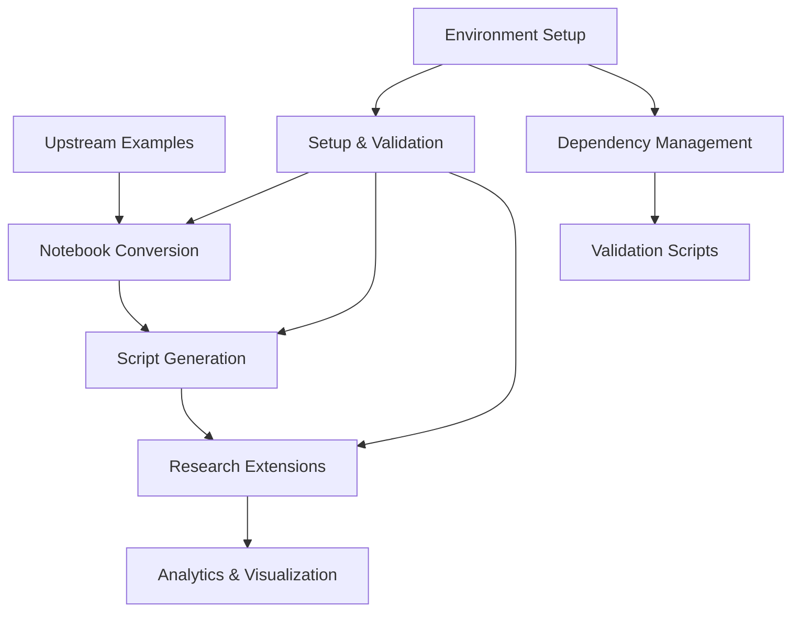

# RxInferExamples.jl - Enhanced Symbiotic Fork


[](https://rxinfer.com)
[](https://examples.rxinfer.com)
[](https://examples.rxinfer.com/how_to_contribute/)
[](https://github.com/reactivebayes/RxInfer.jl/discussions)

## Overview

This repository is an enhanced fork of the original RxInferExamples.jl that maintains full compatibility with the upstream repository while adding:

- **Automated Setup & Validation**: Comprehensive environment management via `support/setup.jl`
- **Notebook-to-Script Conversion**: Automated conversion of Jupyter notebooks to executable Julia scripts
- **Research Extensions**: Advanced implementations and analytics in `research/` subdirectories
- **Enhanced Analytics**: Detailed visualizations and performance analysis for key examples
- **Unified Workflow**: Integrated pipeline from setup to research execution

## Python Integration

RxInfer can be used from Python through our client-server infrastructure:

- **[RxInferServer.jl](https://github.com/lazydynamics/RxInferServer)** - A RESTful API service for deploying RxInfer models
- **[RxInferClient.py](https://github.com/lazydynamics/RxInferClient.py)** - Python SDK for interacting with RxInferServer

The server provides OpenAPI-compliant endpoints for model deployment and inference, while the Python client offers a convenient interface to:
- Create and manage model instances
- Execute inference tasks
- Monitor inference progress
- Handle authentication and API keys
- Process results in a native format

For more information, visit:
- [Server Documentation](https://server.rxinfer.com)
- [Python SDK Documentation](https://lazydynamics.github.io/RxInferClient.py/)

## Core Repository Features

This repository contains examples for [RxInfer.jl](https://github.com/ReactiveBayes/RxInfer.jl), a Julia package for reactive message passing and probabilistic programming.

Navigate to the [Examples](https://examples.rxinfer.com) page to check the pre-rendered examples or clone the repository and run the examples locally. Additionally, explore the official [RxInfer.jl](https://docs.rxinfer.com) documentation.

### Enhanced Workflow



### Key Components

- **`examples/`**: Original Jupyter notebooks from upstream repository
- **`scripts/`**: Executable Julia scripts converted from notebooks
- **`support/`**: Setup, validation, and utility scripts
- **`research/`**: Extended implementations and research explorations
- **`docs/`**: Documentation and build system

## Quick Start with Enhanced Workflow

### Option 1: Unified Setup (Recommended)

Run the complete setup, conversion, and build pipeline:

```bash
# Clone the repository
git clone https://github.com/your-username/RxInferExamples.jl.git
cd RxInferExamples.jl

# Run unified setup (non-interactive, with conversion and verification)
julia support/setup.jl --convert --verify
```

This single command:
- Updates Julia and dependencies
- Converts notebooks to scripts
- Builds examples and documentation
- Validates the entire workflow

### Option 2: Step-by-Step Setup

1. **Clone the repository**:
   ```bash
   git clone https://github.com/your-username/RxInferExamples.jl.git
   cd RxInferExamples.jl
   ```

2. **Environment Setup**:
   ```bash
   julia support/setup.jl --convert --verify
   ```

3. **Convert Notebooks to Scripts**:
   ```bash
   julia support/notebooks_to_scripts.jl --skip-existing --verify
   ```

4. **Build Examples**:
   ```bash
   make examples
   ```

5. **Build Documentation**:
   ```bash
   make docs
   make preview
   ```

### Advanced Usage

For development and research work:

```bash
# Run research examples with setup
research/run_research/run.sh --incremental

# Convert specific notebooks only
julia support/notebooks_to_scripts.jl --filter "Coin Toss" --force

# Build with local RxInfer development version
make examples-dev RXINFER=/path/to/local/RxInfer.jl
```

> **Note**: All examples are available as both Jupyter notebooks (`examples/`) and executable Julia scripts (`scripts/`). The enhanced workflow maintains upstream compatibility while enabling advanced research extensions.

## Research and Development Workflow

### Unified Research Runner

For comprehensive setup, notebook conversion, and running research examples:

```bash
# Incremental mode (recommended)
research/run_research/run.sh --incremental

# Overwrite all conversions
research/run_research/run.sh --overwrite

# Interactive mode for custom configuration
research/run_research/run.sh --interactive
```

Configuration defaults are in `research/run_research/run_config.yaml`:

```yaml
mode: incremental          # incremental | overwrite
build:
  examples: 0              # 0 = build, 1 = skip
  docs: 0                  # 0 = build, 1 = skip
quiet: 0                   # 0 = verbose, 1 = quiet
force: 0                   # 0 = normal, 1 = continue on errors
runs:
  gc_single: 1            # 1 = enable, 0 = disable
  gc_suite: 1
  gcn_single: 1
  gcn_suite: 1
  hgf: 1
```

### Research Directory Structure

The `research/` directory contains extended implementations:

- **`generalized_coordinates/`**: Advanced generalized coordinates research with comprehensive analytics
- **`generalized_coordinates_n_order/`**: Higher-order generalized coordinates implementations
- **`hgf/`**: Hierarchical Gaussian Filter extensions
- **`llm/`**: Large Language Model integration examples
- **`pomdp/`**: Enhanced POMDP control with advanced visualizations
- **`streaming/`**: Infinite data stream processing examples

Each research area includes:
- Dedicated `README.md` with detailed documentation
- `Project.toml` for isolated dependencies
- Comprehensive test suites
- Analytics and visualization outputs
- Technical documentation in `TECHNICAL_README.md`

## Contributing to the Symbiotic Fork

This enhanced fork maintains compatibility with the upstream repository while enabling advanced research and development. Contribution guidelines:

### Development Workflow

1. **Start with Validation**: Always run `julia support/setup.jl --convert --verify` before making changes
2. **Follow the Pipeline**: Work through `examples/` → `scripts/` → `research/` progression
3. **Test-Driven Development**: Include comprehensive tests for all modifications
4. **Documentation First**: Update relevant documentation before implementing features
5. **Modular Changes**: Make focused, incremental changes rather than large refactoring

### Contribution Types

- **Bug Fixes**: Fix issues in converted scripts or research implementations
- **Enhancements**: Add analytics, visualizations, or performance improvements to existing examples
- **Research Extensions**: Develop new research implementations in dedicated `research/` subdirectories
- **Documentation**: Improve documentation, tutorials, or workflow guides

### Best Practices

- **Preserve Compatibility**: Ensure changes don't break upstream merging capability
- **Real Data Analysis**: Use actual datasets and realistic scenarios in examples
- **Performance Optimization**: Include benchmarks and optimization where relevant
- **Validation Scripts**: Use support utilities to validate changes

For detailed guidelines, see our [contribution guide](https://examples.rxinfer.com/how_to_contribute/).

## Support and Utilities

### Key Support Scripts

- **`support/setup.jl`**: Comprehensive environment setup and validation
- **`support/notebooks_to_scripts.jl`**: Notebook to script conversion with verification
- **`support/Support_README.md`**: Detailed documentation of support utilities

### Development Tools

- **Makefile**: Build system for examples and documentation
- **Test Suites**: Comprehensive testing in each research subdirectory
- **Validation Scripts**: Automated verification of workflow integrity

## Resources

- [Upstream Contribution Guide](https://examples.rxinfer.com/how_to_contribute/)
- [RxInfer.jl Documentation](https://docs.rxinfer.com)
- [RxInfer.jl Repository](https://github.com/ReactiveBayes/RxInfer.jl)
- [Examples Documentation](https://examples.rxinfer.com)
- [Enhanced Support Documentation](support/Support_README.md)

## Syncing with Upstream

To maintain compatibility with the original repository:

```bash
git remote add upstream https://github.com/ReactiveBayes/RxInferExamples.jl.git
git fetch upstream
git merge upstream/main
```

> **Important**: After merging upstream changes, always run `julia support/setup.jl --convert --verify` to ensure continued compatibility.

## License

This repository is licensed under the MIT License. See [LICENSE](LICENSE) for details.