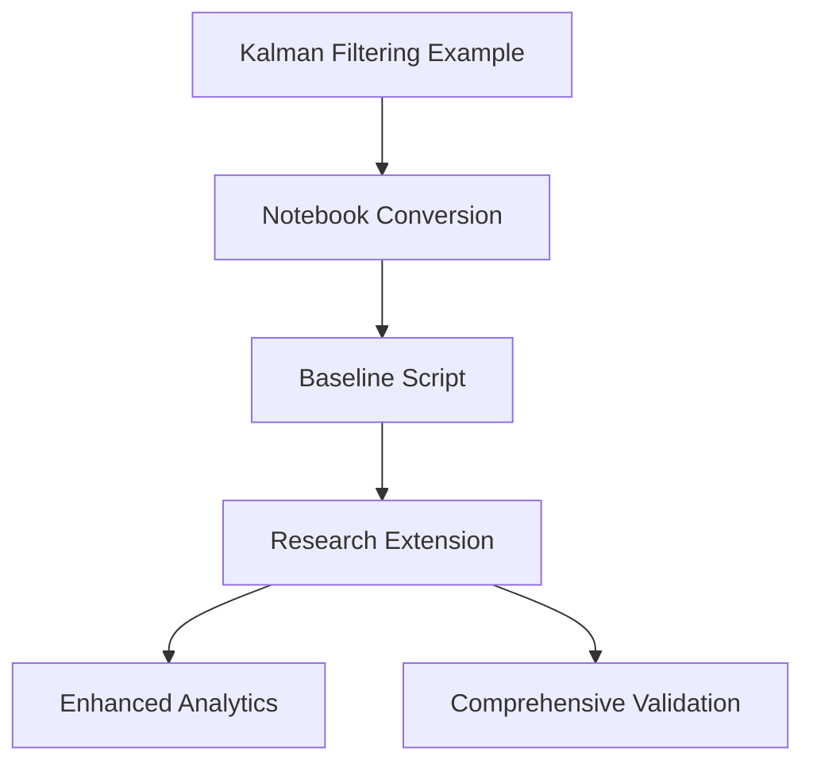

# Generalized Coordinates: Constant-Acceleration Car (1D)

## Overview

This research implementation demonstrates variational inference in generalized coordinates for a continuous state-space model using RxInfer. It extends the basic Kalman filtering examples with advanced analytics, comprehensive visualization, and detailed free energy analysis.

**Integration with Repository Workflow**:
- Builds upon baseline scripts converted from `examples/Kalman filtering and smoothing/`
- Enhances basic filtering with generalized coordinate transformations
- Provides comprehensive analytics and validation not available in baseline examples

### Core Research Features

- **State**: `x = [position, velocity, acceleration]` in generalized coordinates
- **Dynamics**: constant-acceleration with Gaussian process noise
- **Observations**: noisy position; optionally velocity
- **Analytics**: Comprehensive free energy analysis and posterior predictive checks
- **Visualization**: Multi-panel dashboards and animated state evolution

### Repository Integration



### Contents
- `src/GeneralizedCoordinatesExamples.jl`: module entrypoint exporting `GCUtils`, `GCModel`, `GCViz`
- `src/GCUtils.jl`: data generation, `(A,B,Q)` matrices, per-time Gaussian free-energy terms
- `src/GCModel.jl`: RxInfer `@model` and mean-field constraints
- `src/GCViz.jl`: plotting helpers and dashboards
- `run_gc_car.jl`: end-to-end run script
- `test/runtests.jl`: comprehensive test suite
- `gen_coord_fep_research.md`: background article linking FEP, generalized filtering, HGF, and message passing

### Quickstart
```julia
julia --project=research/generalized_coordinates research/generalized_coordinates/run_gc_car.jl
```

Outputs are written to `research/generalized_coordinates/outputs/`.

### Installation
- Julia ≥ 1.9
- The project activates its own environment (`Project.toml`) and resolves dependencies automatically.

### Configuration knobs (edit `run_gc_car.jl`)
- `n`, `dt`: trajectory length and time-step
- `σ_a`: process noise std for acceleration
- `σ_obs_pos`: observation noise std for position
- `σ_obs_vel`: set to `NaN` for position-only; set to a finite std to also observe velocity
- `x0_mean`, `x0_cov`: prior over initial state

The model matrices are built via `GCUtils.constant_acceleration_ABQ(dt; σ_a=...)` and the observation matrix `B` is selected based on whether velocity is observed.

### What the script does
1. Simulates ground-truth `x_true` and observations `y` in generalized coordinates.
2. Builds a linear-Gaussian SSM `@model` in `GCModel.gc_car_model`.
3. Runs RxInfer with mean-field constraints, history collection, and `free_energy=true`.
4. Saves posteriors, diagnostic plots, animations, and CSV reports.

### Key outputs (in `outputs/`)
- `gc_pos.png` or `gc_pos_vel.png`: inference vs truth
- `gc_states.png`: all states with credible ribbons
- `gc_free_energy_terms.png`: per-time observation/dynamics and total terms (Gaussian approximation)
- `gc_dashboard.png`: compact overview
- `gc_y_fit.png`, `gc_stdres_hist.png`, `gc_stdres_qq.png`, `gc_stdres_acf.png`: posterior predictive checks
- `gc_rmse.png`, `gc_mse_time.png`, `gc_coverage.png`, `gc_state_coverage_time.png`: error/coverage diagnostics
- `gc_posterior_summary.csv`: posterior mean/variance by time
- `gc_free_energy_timeseries.csv`: approximate per-time FE decomposition (obs, prior, dyn, total)
- `gc_free_energy_obs_dim_terms.csv`: per-dimension observation contributions (if `R` diagonal)
- `rxinfer_free_energy.csv`: RxInfer free energy per iteration with deltas
- `gc_position_animation.gif`, `gc_states_animation.gif`: animations (when supported)

### Switching observation modalities
- Position-only: set `σ_obs_vel = NaN` (default). `B = [1 0 0]`, `R = Diagonal([σ_obs_pos^2])`.
- Position+velocity: set e.g. `σ_obs_vel = 0.6`. `B = [1 0 0; 0 1 0]`, `R = Diagonal([σ_obs_pos^2, σ_obs_vel^2])`.

### Module overview
- `GCUtils`
  - `constant_acceleration_ABQ(dt; σ_a, ...)`: returns `(A, B=I, Q)` with PD safeguards
  - `generate_gc_car_data(rng, n, dt; ...)`: simulates `(x, y)` sequences
  - `free_energy_timeseries(...)`: Gaussian approximation to node-level FE contributions (obs/dyn/prior)
- `GCModel`
  - `gc_car_model(y, A, B, Q, R, x0_mean, x0_cov)`: linear-Gaussian SSM in generalized coordinates
  - `make_constraints()`: mean-field `q(x,y) = q(x) q(y)`
- `GCViz`
  - Plotting and PPC utilities: state ribbons, residuals, standardized residuals, ACF/QQ, coverage, RMSE, animations

### Tests
```julia
julia --project=research/generalized_coordinates -e 'using Pkg; Pkg.test()'
```
Tests cover:
- Inference fidelity under position-only and pos+vel observations
- Free-energy reporting and monotonicity sanity checks
- Run-script smoke test and presence of output CSVs (`rxinfer_free_energy.csv`, `gc_posterior_summary.csv`, `gc_free_energy_timeseries.csv`)

### Tips and troubleshooting
- If plots are blank in headless environments, the backend falls back to a static PNG setup (`GCViz` sets GR non-interactive).
- If `Pkg` spends time precompiling, set `ENV["JULIA_PKG_PRECOMPILE_AUTO"] = "0"` as in `run_gc_car.jl`.
- For longer GIFs, ensure the environment supports writing large animations or disable animation blocks.

### Technical background
See `gen_coord_fep_research.md` and the accompanying `TECHNICAL_README.md` for the full mathematical treatment (FEP, generalized filtering, HGF, variational message passing) and how they map onto the implementation here.
