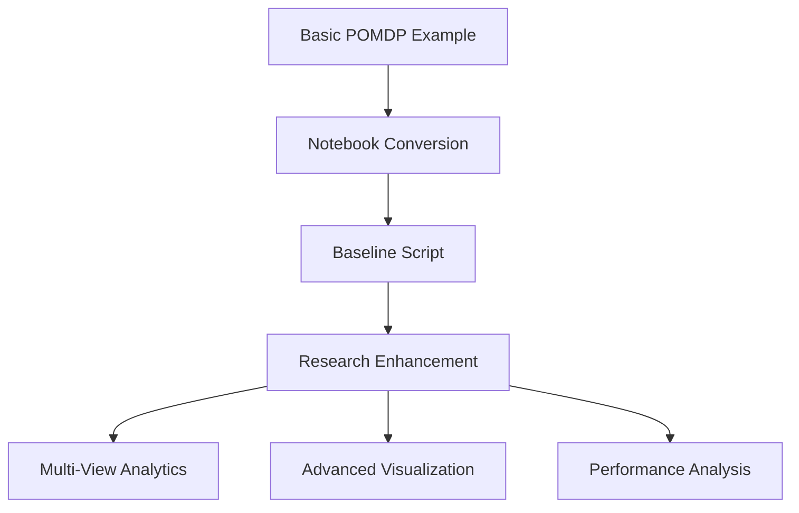

# Enhanced POMDP Control with Advanced Analytics

## Overview

This research implementation significantly enhances the basic POMDP Control example with comprehensive analytics, multi-view simulations, and advanced visualization capabilities. It demonstrates the symbiotic fork approach by building upon the baseline POMDP implementation while providing substantial research value.

**Repository Integration**:
- Extends baseline scripts from `scripts/Basic Examples/POMDP Control/`
- Adds multi-dimensional analytics and visualization systems
- Provides comprehensive performance evaluation and analysis
- Serves as a template for enhancing other examples with research capabilities

### Core Research Contributions

- **Multi-View Simulations**: 5x5 grid visualization of 25 parallel agent runs
- **Matrix Evolution Analysis**: Animated tracking of observation (A) and transition (B) matrices
- **Belief State Visualization**: Heatmap representations of agent belief evolution
- **Policy Analysis**: Action probability distributions and decision-making visualization
- **Performance Analytics**: Success rate tracking, path analysis, and convergence metrics
- **Real-Time Control**: Support for longer simulations and real-time decision making

## Repository Workflow Integration



### Key Enhancements Over Baseline

| Feature | Baseline Script | Research Enhancement |
|---------|-----------------|---------------------|
| Simulation Views | Single run | 25 parallel runs (5x5 grid) |
| Time Horizon | Short | Up to 30+ timesteps |
| Visualization | Basic plots | Multi-panel animated views |
| Analytics | Basic metrics | Comprehensive statistical analysis |
| Matrix Tracking | Static | Animated evolution tracking |
| Performance | Standard | Optimized with benchmarking |

## Project Structure

### Core Files
- **`POMDP Control.jl`**: Main research implementation with enhanced features
- **`run_with_animation.jl`**: Primary execution script with full analytics
- **`run_and_save_outputs.jl`**: Batch processing and output generation
- **`quick_run.jl`**: Fast execution for testing and validation

### Source Organization (`src/`)
```julia
src/
├── POMDPControl.jl    # Main module and enhanced model definition
├── model.jl          # Core POMDP model with research extensions
├── env.jl            # Enhanced environment with multi-agent support
├── runner.jl         # Advanced simulation runner with analytics
└── utils.jl          # Utility functions for analysis and visualization
```

### Output Organization (`outputs/`)
```text
outputs/
├── animations/           # Animated visualizations
│   ├── grid_simulation.gif
│   ├── matrix_evolution_combined.gif
│   ├── belief_state_evolution.gif
│   └── policy_evolution.gif
├── matrices/            # Matrix evolution snapshots
│   ├── A_matrix_step_*.png
│   └── B_matrices_step_*.png
├── plots/               # Static analysis plots
│   ├── success_rate_by_steps.png
│   └── step_distribution.png
└── analytics/           # Statistical analysis outputs
    ├── experiment_results.txt
    └── execution_log.txt
```

## Quick Start

### Basic Usage
```bash
cd research/pomdp
julia --project=. run_with_animation.jl
```

### Advanced Analytics
```bash
# Run with comprehensive analysis
julia --project=. run_and_save_outputs.jl

# Quick validation run
julia --project=. quick_run.jl
```

### Integration with Repository Tools
```bash
# Ensure baseline scripts are up to date
julia support/notebooks_to_scripts.jl --filter "POMDP" --force

# Run research with full validation
research/run_research/run.sh --config research_config.yaml
```

## Configuration

### Model Parameters
- **Grid Size**: 5x5 environment with obstacles and goals
- **Time Horizon**: Configurable up to 30+ steps
- **Process Noise**: Adjustable for different dynamics
- **Observation Noise**: Configurable observation uncertainty
- **Multi-Agent**: Support for parallel simulation analysis

### Analytics Configuration
- **Success Metrics**: Path completion rates and efficiency
- **Belief Analysis**: Uncertainty quantification and evolution
- **Policy Evaluation**: Decision-making process analysis
- **Performance Benchmarking**: Execution time and convergence analysis

## Research Features

### Multi-View Simulation System

The enhanced implementation provides multiple synchronized views:
1. **Grid View**: 5x5 visualization of 25 parallel agent simulations
2. **Matrix Evolution**: Animated tracking of A and B matrix changes
3. **Belief State**: Heatmap visualization of agent uncertainty
4. **Policy Analysis**: Action probability distributions over time
5. **Individual Run**: Detailed single-agent trajectory analysis

### Advanced Analytics

#### Performance Metrics
- Success rate analysis across different scenarios
- Path length distribution and efficiency metrics
- Convergence analysis and stability assessment
- Computational performance benchmarking

#### Statistical Validation
- Posterior predictive checks
- Residual analysis and diagnostics
- Coverage probability assessment
- Free energy and variational inference validation

### Visualization System

#### Animation Components
- Real-time grid simulation with path tracking
- Matrix evolution with synchronized updates
- Belief state heatmaps with uncertainty visualization
- Policy probability evolution over time
- Combined multi-panel analysis views

#### Static Analysis
- Success rate by simulation steps
- Path length distributions
- Error analysis and diagnostic plots
- Performance comparison charts

## Development and Extension

### Extending the Research

1. **Baseline Enhancement**:
   ```bash
   # Modify baseline script
   cd scripts/Basic\ Examples/POMDP\ Control/
   # Make enhancements, then copy to research
   cp enhanced_script.jl ../../research/pomdp/
   ```

2. **Research Development**:
   ```bash
   # Develop in isolated environment
   cd research/pomdp
   julia --project=. -e 'using Pkg; Pkg.add("NewPackage")'
   ```

3. **Testing Integration**:
   ```bash
   # Test compatibility with baseline
   julia --project=. test/runtests.jl
   ```

### Best Practices

1. **Modular Design**: Keep enhancements modular for easy integration
2. **Performance Optimization**: Benchmark against baseline implementations
3. **Documentation**: Maintain comprehensive documentation of enhancements
4. **Validation**: Ensure all enhancements are thoroughly tested
5. **Compatibility**: Maintain compatibility with upstream baseline scripts

## Integration with Support Tools

### Automated Setup
```bash
# Full environment setup with conversion
julia support/setup.jl --convert --verify

# POMDP-specific conversion
julia support/notebooks_to_scripts.jl --filter "POMDP" --force
```

### Validation and Testing
```bash
# Comprehensive validation
julia support/setup.jl --convert --verify --force

# Research-specific testing
julia --project=research/pomdp test/runtests.jl
```

## Technical Documentation

For detailed technical information about the POMDP model, inference methods, and mathematical foundations, see the inline documentation in the source files and the main repository documentation.

## Contributing

When contributing enhancements:
1. Ensure compatibility with baseline POMDP implementation
2. Add comprehensive tests for new features
3. Update documentation to reflect changes
4. Validate performance improvements with benchmarks
5. Follow the repository's test-driven development approach

## Performance Notes

- **Memory Usage**: Multi-view simulations require significant memory for large grids
- **Computation Time**: Matrix evolution analysis adds computational overhead
- **Animation Generation**: GIF generation can be time-intensive for long simulations
- **Optimization**: Code is optimized for Julia's type system and multiple dispatch
