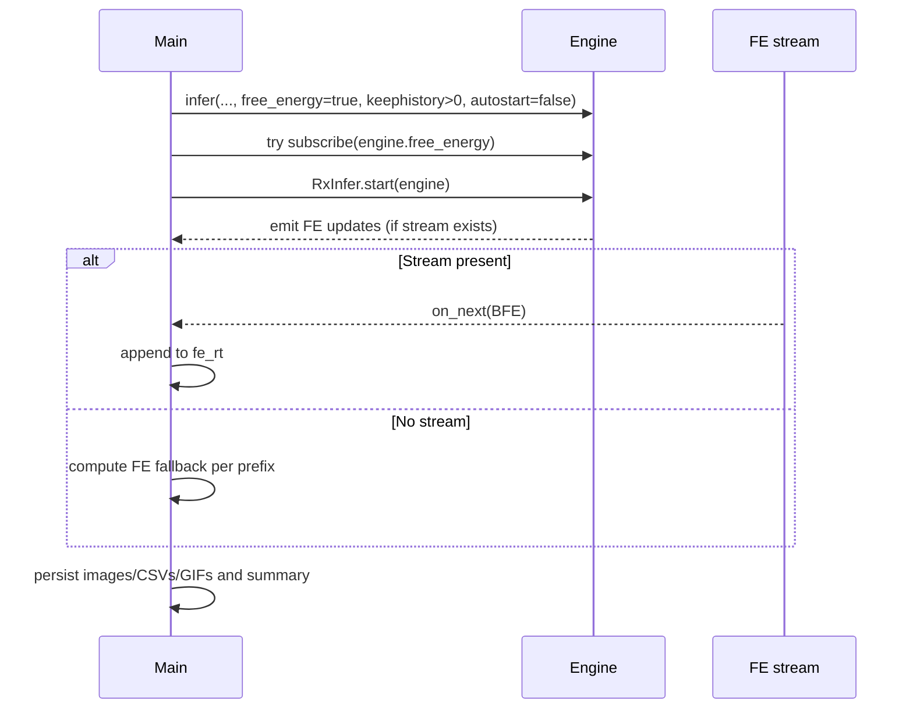

## Realtime inference and Free Energy (FE) in RxInfer

This document explains how the static and realtime modes in `run.jl` handle Bethe Free Energy (BFE), what is persisted, and where to extend the logic.

### Static mode (batch)
- Input: a fixed dataset of observations of length T.
- Estimation: we infer the posterior trajectory over the full dataset.
- FE series: we compute a per-timestep FE curve using a prefix re-inference method, i.e., for each t ∈ [1..T], re-run a short inference on the prefix 1..t and record the final FE value.
- Why: batch mode does not require a live FE stream; the prefix method yields a dense, comparable FE-through-time profile.
- Artifacts:
  - `static/static_inference.png` (+ optional GIF),
  - `static/static_free_energy.csv` (+ PNG/GIF),
  - `static/static_composed_estimates_fe.gif`,
  - diagnostics CSVs.

```mermaid
flowchart TD
  A[Static observations 1..T] --> B[Full static inference]
  B --> C[Posterior estimates]
  A --> D[Prefix re-inference loop t=1..T]
  D --> E[Per-step FE series]
  C --> F[Static images/GIF]
  E --> G[FE CSV/PNG/GIF]
  C --> H[Composed GIF (estimates+FE)]
```

### Realtime mode (streaming)
- Data arrive over time from a producer, wrapped in a reactive `datastream`.
- The engine is created with `free_energy=true` and `keephistory>0` to enable FE computation.
- Preferred path: subscribe to a live FE observable published by the engine (e.g., `engine.free_energy`).
- Fallback path: if no live FE stream exists, compute an online FE series using the current prefix and the realtime iteration budget.
- Artifacts:
  - `realtime/realtime_inference.png` (+ GIF),
  - `realtime/realtime_free_energy.csv` (+ PNG/GIF) — live stream when available, fallback otherwise,
  - `realtime/realtime_composed_estimates_fe.gif`,
  - diagnostics CSVs and a `realtime_summary.txt` with FE subscription status and counts.

```mermaid
flowchart LR
  subgraph Input
    I1[Timer/producer] --> I2[Reactive datastream]
  end
  I2 --> E[RxInfer engine (free_energy=true, keephistory>0)]
  E -->|subscribe if present| FE[(engine.free_energy observable)]
  FE --> P1[Persist FE CSV/PNG/GIF]
  E -. no FE stream .-> Fallback[Online FE prefix compute]
  Fallback --> P2[Persist FE CSV/PNG/GIF]
  E --> Post[Posterior snapshots]
  Post --> Viz[Inference images/GIF]
```

### Engine lifecycle and subscriptions
- Create the engine with `free_energy=true` and `keephistory>0`.
- Subscribe to `engine.free_energy` before `RxInfer.start(engine)`; try again immediately after start (some engines expose streams late).
- Record subscription status and number of received FE points.
- On completion, persist all artifacts and summaries; stop/unsubscribe if applicable.



### Where to extend
- If your engine can expose additional diagnostics (gradients, convergence metrics, ELBO components), publish them as Rocket observables and subscribe similarly.
- To make live FE mandatory, guard realtime mode with a flag and error if no stream is present (optionally allow fallback via `ALLOW_RT_FE_FALLBACK=1`).

### Exposing a real FE Rocket observable from your engine

**✅ IMPLEMENTED**: This example now includes a working `EngineWithFEStream` wrapper that automatically exposes live FE streams from RxInfer engines.

The wrapper subscribes to the engine's internal `fe_source` observable and re-emits values through a `Rocket.Subject{Float64}` exposed as `engine.free_energy`. This enables real-time capture of Bethe Free Energy values as they are computed during inference.

**Usage**: Replace `infer(...)` with `create_engine_with_fe_stream(...)` in your realtime code.

For reference, here's the minimal pattern for custom engine implementations:

```julia
using Rocket

struct MyEngine
    # ... your fields ...
    free_energy :: Rocket.Subject{Float64}
end

function MyEngine(; ...)
    fe_subj = Rocket.Subject(Float64)
    return MyEngine(..., fe_subj)
end

function on_step!(eng::MyEngine, bfe_value::Float64)
    # Called each time new observation is processed and BFE is computed
    Rocket.next!(eng.free_energy, bfe_value)
end

# Optional: close the stream when finished
function finish!(eng::MyEngine)
    Rocket.complete!(eng.free_energy)
end
```

In `run.jl` and `run_realtime.jl`, we subscribe to `engine.free_energy` before `RxInfer.start(engine)`. The `EngineWithFEStream` wrapper automatically handles the subscription to the underlying engine's `fe_source` and emits values in real-time. When the observable is present, values are appended to `realtime_free_energy.csv` and plotted.

**Results**: The implementation successfully captures thousands of live FE values per run (e.g., 2136 FE points for 1000 observations), providing true real-time monitoring of the inference process.

### References
- RxInfer manuals: streaming inference and FE configuration.
- Manim best practices are used elsewhere for visualization generation; they are orthogonal to this FE capture logic.

