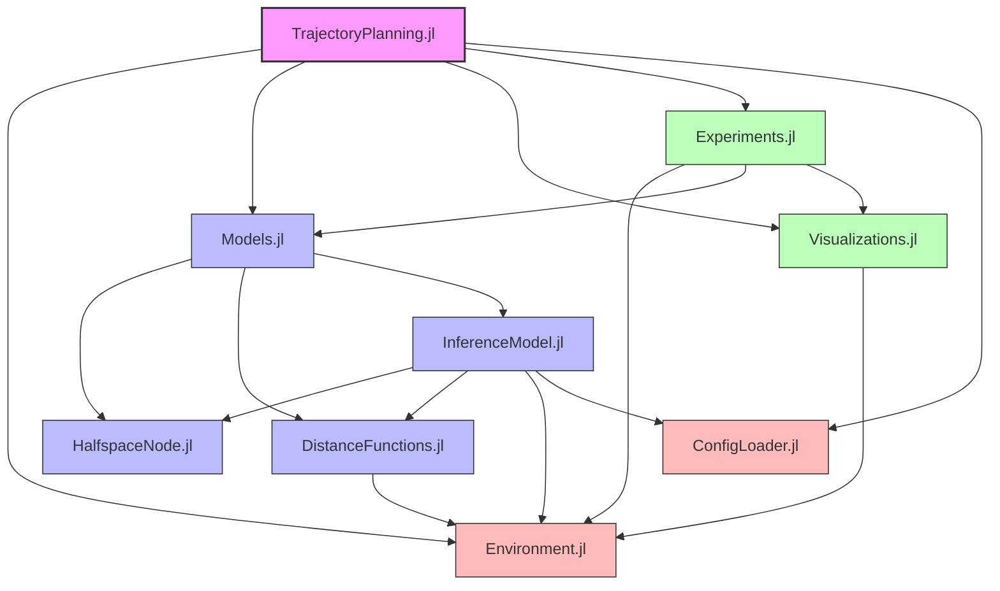
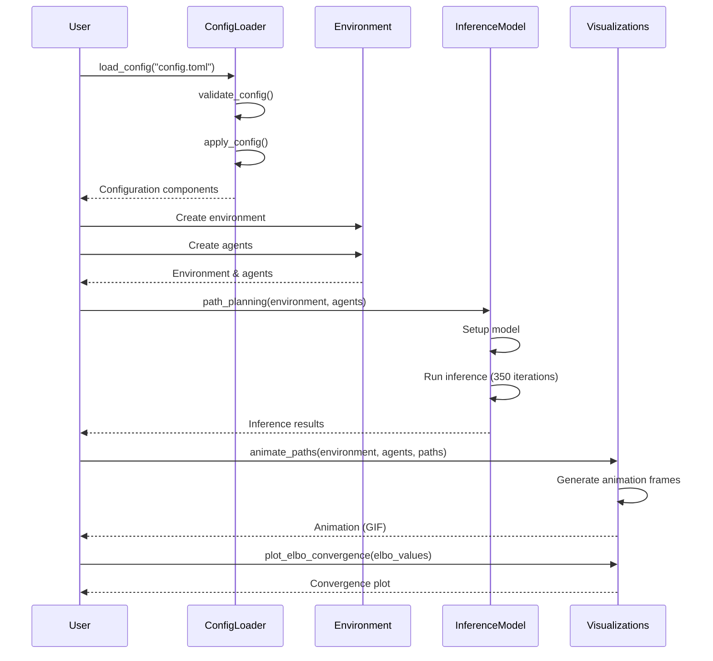
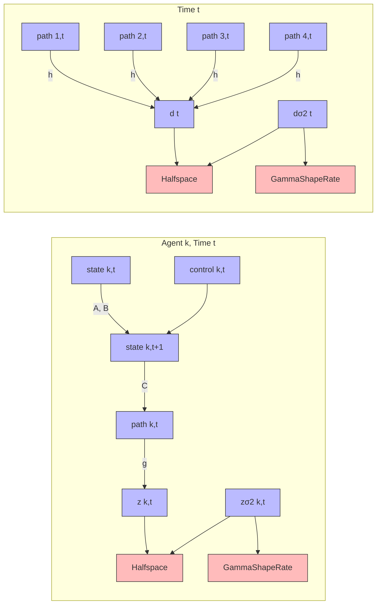
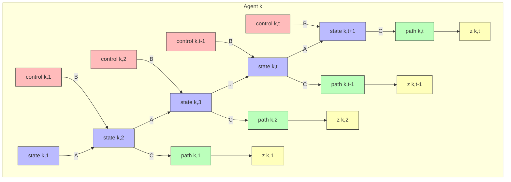
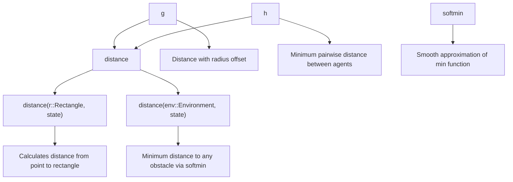
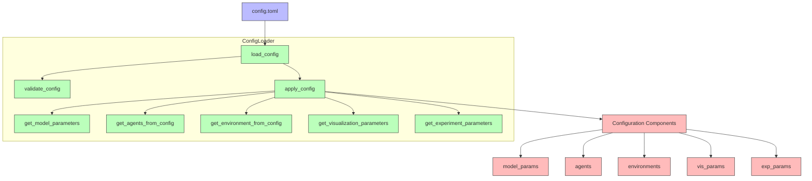
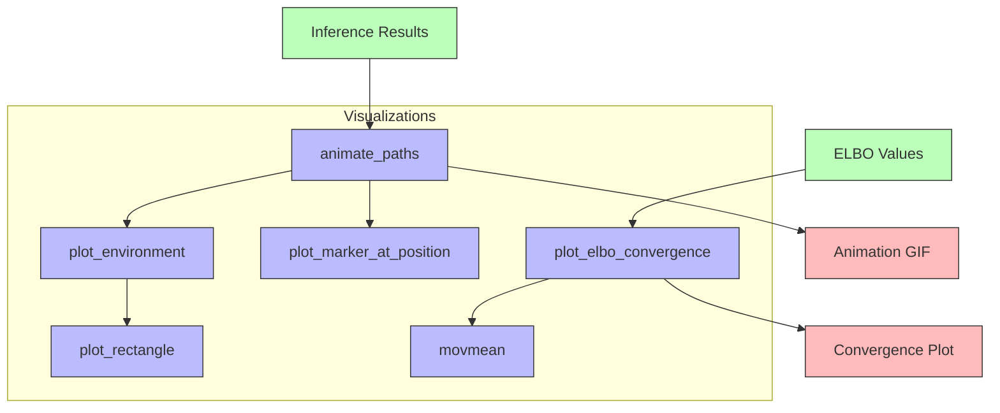
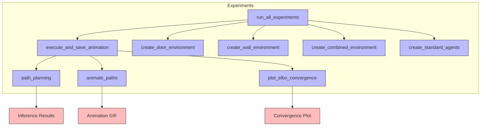
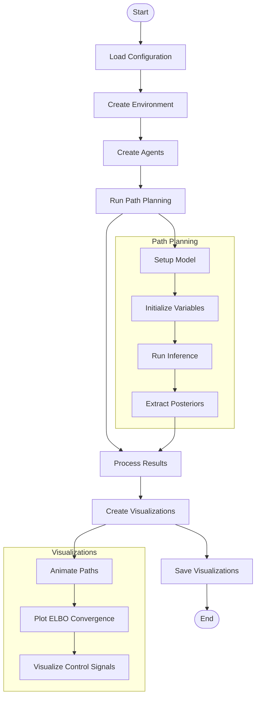

# Multi-agent Trajectory Planning with Probabilistic Inference

## Table of Contents

- [Project Organization](#project-organization)
- [Module Structure](#module-structure)
- [Runtime Flow](#runtime-flow)
- [Technical Approach](#technical-approach)
- [Model Description](#model-description)
- [Mathematical Implementation](#mathematical-implementation)
- [The Halfspace Node](#the-halfspace-node)
- [Distance Functions](#distance-functions)
- [Inference Approach](#inference-approach)
- [Configuration System](#configuration-system)
- [Visualization Pipeline](#visualization-pipeline)
- [Experiment Process](#experiment-process)
- [Implementation Notes](#implementation-notes)
- [Output Files](#output-files)
- [Future Improvements](#future-improvements)

## Project Organization

The project is organized into several modular components:

1. **Core Module Structure**:
   - `TrajectoryPlanning.jl`: Main module that integrates all components
   - `Environment.jl`: Environment and agent definitions
   - `Models.jl`: Probabilistic model implementation
   - `Visualizations.jl`: Plotting and animation functions
   - `Experiments.jl`: Experiment execution functions
   - `ConfigLoader.jl`: Configuration loading and validation

2. **Execution Scripts**:
   - `run_experiment.jl`: Command-line configurable experiment runner
   - `main.jl`: Entry point for running all standard experiments

3. **File Interactions**:
   - Environment definitions feed into the probabilistic model
   - Model outputs are processed by visualization functions
   - Experiment functions coordinate the execution and data collection
   - TrajectoryPlanning module provides a unified interface to all components

See `README.md` for detailed usage instructions and examples.

## Module Structure

The codebase is organized into several modular components that interact with each other. The following diagram shows the module dependencies:



### Module Descriptions

1. **TrajectoryPlanning.jl**: Main module that re-exports all components
2. **Environment.jl**: Defines environment and agent structures
3. **Models.jl**: Integrates model components (HalfspaceNode, DistanceFunctions, InferenceModel)
4. **Visualizations.jl**: Provides visualization and animation functions
5. **Experiments.jl**: Contains experiment execution logic
6. **ConfigLoader.jl**: Manages configuration loading from TOML
7. **HalfspaceNode.jl**: Defines custom RxInfer node for constraints
8. **DistanceFunctions.jl**: Implements distance calculations for collision avoidance
9. **InferenceModel.jl**: Contains the main probabilistic model and inference logic

## Runtime Flow

The following diagram illustrates the runtime flow of a typical experiment:



## Technical Approach

The trajectory planning is formulated as a probabilistic inference problem, where:
- Each agent has a state vector [x, y, vx, vy] representing position and velocity
- The environment contains obstacles defined as rectangles
- The model enforces constraints for obstacle avoidance and agent-agent collision avoidance
- Inference is performed using variational message passing

## Model Description

The probabilistic model is defined using a factor graph approach where random variables are connected through factors representing probabilistic dependencies. The core components include:



### State Space Model

Each agent follows linear dynamics:
- State transition: `state[k, t+1] ~ A * state[k, t] + B * control[k, t]`
- Observation model: `path[k, t] ~ C * state[k, t+1]`

Where:
- `A` is the state transition matrix [1 dt 0 0; 0 1 0 0; 0 0 1 dt; 0 0 0 1]
- `B` is the control input matrix [0 0; dt 0; 0 0; 0 dt]
- `C` is the observation matrix [1 0 0 0; 0 0 1 0]
- `dt` is the time step (set to 1 in this implementation)

The state-space model for each agent is defined as:



### Constraint Formulation

Constraints are encoded as observations through a custom Halfspace node, which creates soft constraints that the inference process tries to satisfy.

Two main constraints are modeled:
1. **Environment constraints**: Agents should not collide with obstacles
   - `z[k, t] ~ g(environment, rs[k], path[k, t])`
   - `z[k, t] ~ Halfspace(0, zσ2[k, t], γ)`
   
2. **Agent-agent collision avoidance**:
   - `d[t] ~ h(environment, rs, path[1, t], path[2, t], path[3, t], path[4, t])`
   - `d[t] ~ Halfspace(0, dσ2[t], γ)`

## Mathematical Implementation

### State-Space Representation

The state for each agent is a 4-dimensional vector:
- `[x_position, x_velocity, y_position, y_velocity]`

The system matrices are:
- `A = [1 dt 0 0; 0 1 0 0; 0 0 1 dt; 0 0 0 1]` (state transition)
- `B = [0 0; dt 0; 0 0; 0 dt]` (control input)
- `C = [1 0 0 0; 0 0 1 0]` (observation)

### Prior Distributions

- Initial state: `MvNormal(mean = zeros(4), covariance = initial_state_variance * I)`
- Control inputs: `MvNormal(mean = zeros(2), covariance = control_variance * I)`
- Constraint parameters: `GammaShapeRate(gamma_shape, gamma_scale)`
- Goal constraints: `MvNormal(mean = state[k, 1/nr_steps+1], covariance = goal_constraint_variance * I)`

## The Halfspace Node

The Halfspace node is a custom RxInfer node that implements soft inequality constraints in the probabilistic model. It mathematically represents the constraint that a value should be greater than a specified threshold.

### Mathematical Definition

The Halfspace node implements the constraint: `out > a`, where:
- `out`: The output variable (e.g., distance to obstacle)
- `a`: The threshold (typically 0)
- `σ2`: Variance parameter that controls the softness of the constraint
- `γ`: Scaling parameter that affects the constraint strength

### Implementation

The Halfspace node is implemented with two key message passing rules:

1. **Forward Rule** (`:out` marginal):
```julia
@rule Halfspace(:out, Marginalisation) (q_a::Any, q_σ2::Any, q_γ::Any) = begin
    return NormalMeanVariance(mean(q_a) + mean(q_γ) * mean(q_σ2), mean(q_σ2))
end
```

This rule creates a Normal distribution that is shifted away from the constraint boundary by an amount proportional to the constraint strength (`γ`) and softness (`σ2`).

2. **Variance Rule** (`:σ2` marginal):
```julia
@rule Halfspace(:σ2, Marginalisation) (q_out::Any, q_a::Any, q_γ::Any, ) = begin
    return BayesBase.TerminalProdArgument(PointMass(
        1 / mean(q_γ) * sqrt(abs2(mean(q_out) - mean(q_a)) + var(q_out))
    ))
end
```

This rule adaptively sets the constraint softness based on how far the current value is from the constraint boundary.

### Effect on Inference

The Halfspace node creates a "soft barrier" that:
1. Pushes agent trajectories away from obstacles
2. Prevents agents from colliding with each other
3. Adaptively adjusts constraint strength based on proximity to violations

As inference progresses, the Halfspace nodes help shape the posterior distributions over agent paths to satisfy the constraints while maintaining smooth trajectories.

## Distance Functions

The model uses two key distance functions:
- `g()`: Calculates distance from an agent to obstacles, adjusted for agent radius
- `h()`: Calculates minimum distance between all agent pairs, adjusted for agent radii

The distance functions are crucial for collision avoidance:



### Rectangle Distance Calculation

For a rectangle obstacle, the distance function computes:
```julia
function distance(r::Rectangle, state)
    if abs(state[1] - r.center[1]) > r.size[1] / 2 || abs(state[2] - r.center[2]) > r.size[2] / 2
        # outside of rectangle
        dx = max(abs(state[1] - r.center[1]) - r.size[1] / 2, 0)
        dy = max(abs(state[2] - r.center[2]) - r.size[2] / 2, 0)
        return sqrt(dx^2 + dy^2)
    else
        # inside rectangle
        return max(abs(state[1] - r.center[1]) - r.size[1] / 2, abs(state[2] - r.center[2]) - r.size[2] / 2)
    end
end
```

### The Softmin Function

The `softmin` function creates a differentiable approximation of the minimum function, allowing the model to handle multiple constraints simultaneously:
```julia
softmin(x; l=10) = -logsumexp(-l .* x) / l
```
Where `l` is a temperature parameter that controls the smoothness of the approximation.

### Agent Collision Avoidance

The `h()` function computes pairwise distances between all agents and returns the softmin:
```julia
function h(environment, radiuses, states...)
    # Calculate pairwise distances between all agents
    distances = Real[]
    n = length(states)

    for i in 1:n
        for j in (i+1):n
            push!(distances, norm(states[i] - states[j]) - radiuses[i] - radiuses[j])
        end
    end

    return softmin(distances)
end
```

## Inference Approach

The inference is performed using variational message passing with the following components:

1. **Initialization**: Initial distributions for states and controls
2. **Constraints**: Mean-field variational factorization
3. **Linearization**: Non-linear functions are approximated using linearization
4. **Iterations**: Typically 350 iterations are performed for convergence

The inference constraints are defined with:

```julia
@constraints function path_planning_constraints()
    # Mean-field variational constraints on the parameters
    q(d, dσ2) = q(d)q(dσ2)
    q(z, zσ2) = q(z)q(zσ2)
end
```

### Variational Inference

The inference uses mean-field variational approximation to factorize the joint posterior distribution into simpler components. This approach allows efficient inference in the complex model.

The initialization for inference is defined as:
```julia
init = @initialization begin
    q(dσ2) = repeat([PointMass(1)], nr_steps)
    q(zσ2) = repeat([PointMass(1)], nr_agents, nr_steps)
    q(control) = repeat([PointMass(0)], nr_steps)

    μ(state) = MvNormalMeanCovariance(randn(rng, 4), 100I)
    μ(path) = MvNormalMeanCovariance(randn(rng, 2), 100I)
end
```

The approximation methods used for the non-linear functions:
```julia
door_meta = @meta begin 
    h() -> Linearization()
    g() -> Linearization()
end
```

## Configuration System

The configuration system manages all parameters for the model:



### Configuration Parameters

The configuration file (`config.toml`) contains sections for:

1. **Model Parameters**: Time step, matrices, iterations, etc.
2. **Agent Configurations**: Radius, initial and target positions
3. **Environment Definitions**: Obstacle positions and sizes
4. **Visualization Parameters**: Plot boundaries, FPS, etc.
5. **Experiment Parameters**: Random seeds, output filenames

The TOML configuration allows for flexible customization of all aspects of the simulation without modifying the core code. Example entries from the configuration file:

```toml
# Model parameters
[model]
dt = 1.0
gamma = 1.0
nr_steps = 40
nr_iterations = 350

# Agent configuration
[[agents]]
radius = 2.5
initial_position = [-4.0, 10.0]
target_position = [-10.0, -10.0]

# Environment definition
[environments.door]
description = "Two parallel walls with a gap between them"

[[environments.door.obstacles]]
center = [-40.0, 0.0]
size = [70.0, 5.0]
```

## Visualization Pipeline

The visualization system creates animations and plots:



### Animation Process

1. For each time step:
   - Plot the environment with obstacles
   - Plot each agent at its position
   - Draw the path taken so far
   - Optionally show target positions
2. Combine frames into an animated GIF

### Available Visualization Functions

1. **Path Animations**:
   - `animate_paths(environment, agents, paths; filename, fps, ...)`: Create animations of agent movements over time

2. **Static Visualizations**:
   - `plot_environment(environment; x_limits, y_limits, ...)`: Plot obstacles in the environment
   - `plot_elbo_convergence(elbo_values; filename)`: Plot ELBO convergence metrics
   - `plot_path_uncertainties(environment, agents, paths, path_vars; ...)`: Visualize uncertainty in paths

3. **Analysis Visualizations**:
   - `plot_control_signals(agents, controls; ...)`: Visualize control inputs over time
   - `plot_agent_path_3d(environment, agents, paths; ...)`: 3D visualization of agent trajectories
   - `create_path_heatmap(environment; resolution, ...)`: Generate heatmaps of distances to obstacles

## Experiment Process

The experiment workflow integrates all components:



### Full Execution Flow



## Implementation Notes

- The model supports a variable number of agents by using the actual number from input
- Obstacles are represented as rectangles
- Distance functions use a differentiable softmin approximation
- The Halfspace node implements the constraint mechanism
- Results are visualized as animated GIFs showing agent trajectories

## Output Files

The implementation generates various output files for analysis:

1. **Animation GIFs**: Showing agent movements through the environment
   - `door_42.gif`, `door_123.gif`: Animations of agents navigating through a door environment with different seeds
   - `wall_42.gif`, `wall_123.gif`: Animations of agents navigating around a wall obstacle
   - `combined_42.gif`, `combined_123.gif`: Animations of agents navigating through a more complex environment
   
2. **CSV Data Files**:
   - `paths.csv`: Raw path data with columns for agent index, time step, x-position, y-position
   - `controls.csv`: Control inputs with columns for agent index, time step, x-control, y-control
   - `uncertainties.csv`: Path uncertainties with columns for agent index, time step, x-variance, y-variance

3. **Visualization PNGs**:
   - `obstacle_distance.png`: Heatmap showing distance to obstacles throughout the environment
   - `path_uncertainty.png`: Visualization of the uncertainty in the planned paths
   - `convergence.png`: Plot showing convergence of the ELBO during inference
   - `door_environment_heatmap.png`, `wall_environment_heatmap.png`, `combined_environment_heatmap.png`: Heatmaps of the obstacle distance fields for different environments

4. **Summary Files**:
   - `experiment_summary.txt`: Summary of experiment parameters and results
   - `experiment.log`: Detailed log of the experiment execution
   - `README.md`: Overview of the results directory contents

### Environment Definition

The project includes three standard environments:

1. **Door Environment**: Two parallel walls with a gap between them
   ```julia
   function create_door_environment()
       return Environment(obstacles = [
           Rectangle(center = (-40, 0), size = (70, 5)),
           Rectangle(center = (40, 0), size = (70, 5))
       ])
   end
   ```

2. **Wall Environment**: A single wall obstacle in the center
   ```julia
   function create_wall_environment()
       return Environment(obstacles = [
           Rectangle(center = (0, 0), size = (10, 5))
       ])
   end
   ```

3. **Combined Environment**: A combination of walls and obstacles
   ```julia
   function create_combined_environment()
       return Environment(obstacles = [
           Rectangle(center = (-50, 0), size = (70, 2)),
           Rectangle(center = (50, -0), size = (70, 2)),
           Rectangle(center = (5, -1), size = (3, 10))
       ])
   end
   ```

## Future Improvements

Potential improvements to the model include:
- Supporting variable numbers of agents (removing the hard-coded limit of 4)
- Implementing more sophisticated environment representations (beyond rectangles)
- Adding dynamic obstacles that move over time
- Using more advanced approximation methods for non-linear functions
- Implementing online/incremental inference for real-time applications
- Creating a configuration file system to replace hard-coded parameters
- Adding more complex state dynamics models (e.g., including acceleration)
- Implementing hierarchical planning for longer time horizons
- Adding uncertainty in environmental perception

### Output Organization

The implementation organizes outputs into a clear subdirectory structure:

1. **Directory Structure**:
   ```
   results/YYYY-MM-DD_HH-MM-SS/
   ├── animations/      # Contains all animated GIFs
   ├── data/            # Contains all data files (CSV, logs)
   ├── heatmaps/        # Contains environment heatmaps
   ├── visualizations/  # Contains static visualizations
   └── README.md        # Overview of results
   ```

2. **Animations Directory (`animations/`)**:
   - `door_42.gif`, `door_123.gif`: Animations of door environment experiments
   - `wall_42.gif`, `wall_123.gif`: Animations of wall environment experiments
   - `combined_42.gif`, `combined_123.gif`: Animations of combined environment experiments
   - `control_signals.gif`: Visualization of control signals over time

3. **Data Directory (`data/`)**:
   - `paths.csv`: Path data for all agents
   - `controls.csv`: Control inputs for all agents
   - `uncertainties.csv`: Path uncertainties for all agents
   - `experiment.log`: Detailed experiment log
   - `convergence_metrics.csv`: ELBO convergence metrics (if available)

4. **Heatmaps Directory (`heatmaps/`)**:
   - `door_environment_heatmap.png`: Distance field for door environment
   - `wall_environment_heatmap.png`: Distance field for wall environment
   - `combined_environment_heatmap.png`: Distance field for combined environment
   - `obstacle_distance.png`: Obstacle distance heatmap for the current experiment

5. **Visualizations Directory (`visualizations/`)**:
   - `path_visualization.png`: Static visualization of agent paths
   - `path_uncertainty.png`: Visualization of uncertainty in agent paths
   - `control_magnitudes.png`: Plot of control signal magnitudes over time
   - `convergence.png`: ELBO convergence plot
   - `convergence_detailed.png`: Detailed convergence analysis

This organization improves the clarity of the output structure and makes it easier to locate specific results. The subdirectory structure is created automatically when running experiments, and all visualization functions have been updated to use this structure.
