# Multi-agent Trajectory Planning: Technical Documentation

This document provides a comprehensive technical overview of the Multi-agent Trajectory Planning implementation using probabilistic inference with RxInfer.jl.

## Table of Contents

- [Module Structure](#module-structure)
- [Runtime Flow](#runtime-flow)
- [Probabilistic Model](#probabilistic-model)
- [Distance Functions](#distance-functions)
- [Configuration System](#configuration-system)
- [Visualization Pipeline](#visualization-pipeline)
- [Experiment Process](#experiment-process)
- [Detailed System Flow](#detailed-system-flow)
- [Mathematical Implementation](#mathematical-implementation)
- [Configuration File Structure](#configuration-file-structure)

## Module Structure

The codebase is organized into several modular components that interact with each other. The following diagram shows the module dependencies:

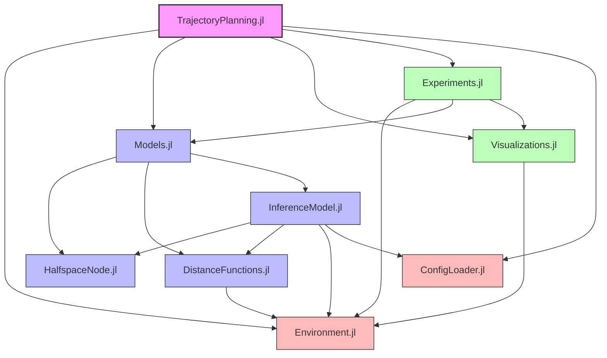

### Module Descriptions

1. **TrajectoryPlanning.jl**: Main module that re-exports all components
2. **Environment.jl**: Defines environment and agent structures
3. **Models.jl**: Integrates model components (HalfspaceNode, DistanceFunctions, InferenceModel)
4. **Visualizations.jl**: Provides visualization and animation functions
5. **Experiments.jl**: Contains experiment execution logic
6. **ConfigLoader.jl**: Manages configuration loading from TOML
7. **HalfspaceNode.jl**: Defines custom RxInfer node for constraints
8. **DistanceFunctions.jl**: Implements distance calculations for collision avoidance
9. **InferenceModel.jl**: Contains the main probabilistic model and inference logic

## Runtime Flow

The following diagram illustrates the runtime flow of a typical experiment:

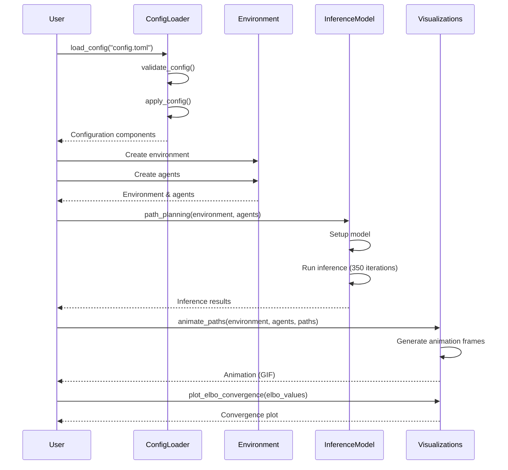

## Probabilistic Model

The probabilistic model is formulated as a factor graph:

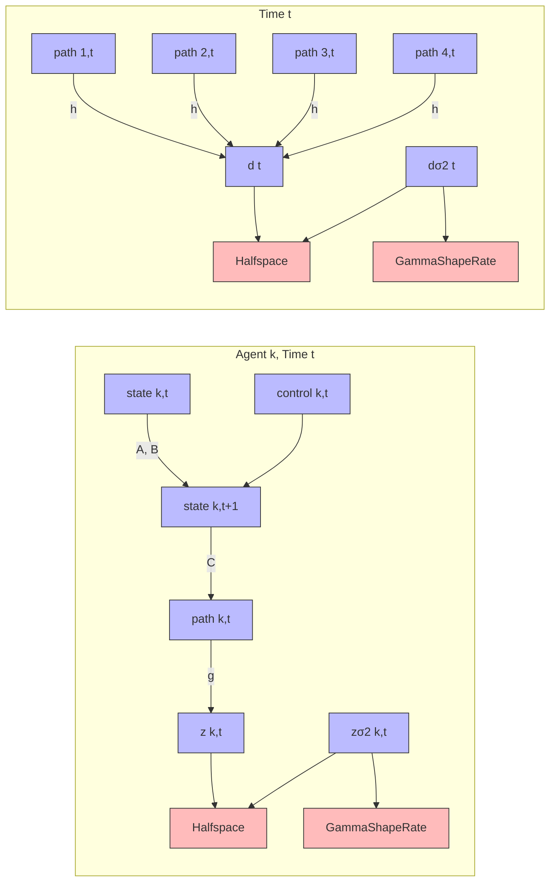

### State-Space Model

The state-space model for each agent is defined as:

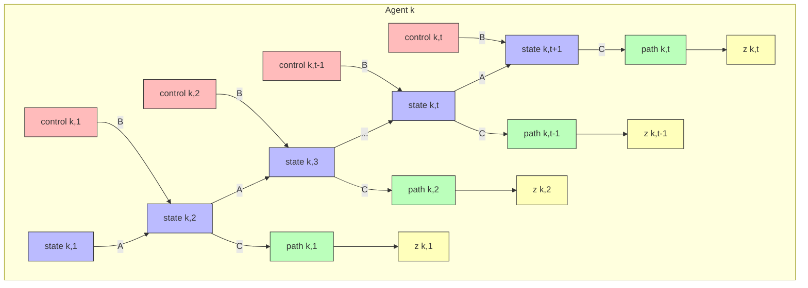

### Mathematical Model

The model is defined by the following equations:

- **State Transition**: `state[k, t+1] ~ A * state[k, t] + B * control[k, t]`
- **Observation Model**: `path[k, t] ~ C * state[k, t+1]`
- **Environment Constraints**: `z[k, t] ~ g(environment, rs[k], path[k, t])` and `z[k, t] ~ Halfspace(0, zσ2[k, t], γ)`
- **Collision Avoidance**: `d[t] ~ h(environment, rs, path[1, t], path[2, t], path[3, t], path[4, t])` and `d[t] ~ Halfspace(0, dσ2[t], γ)`

## Distance Functions

The distance functions are crucial for collision avoidance:

```mermaid
graph LR
    subgraph "DistanceFunctions"
        D[distance] --> DR[distance(r::Rectangle, state)]
        D --> DE[distance(env::Environment, state)]
        G[g] --> D
        H[h] --> D
        S[softmin]
    end
    
    DR --> "Calculates distance<br/>from point to rectangle"
    DE --> "Minimum distance to<br/>any obstacle via softmin"
    G --> "Distance with<br/>radius offset"
    H --> "Minimum pairwise<br/>distance between agents"
    S --> "Smooth approximation<br/>of min function"
```

### Softmin Function

The softmin function is a differentiable approximation of the minimum function:

```
softmin(x; l=SOFTMIN_TEMPERATURE) = -logsumexp(-l .* x) / l
```

This allows for smooth gradient-based optimization during inference.

## Configuration System

The configuration system manages all parameters for the model:

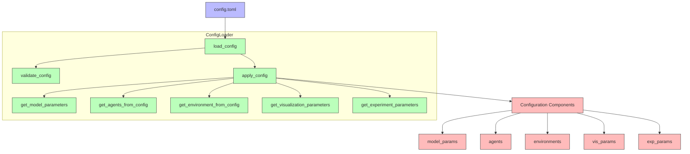

### Configuration Parameters

The configuration file (`config.toml`) contains sections for:

1. **Model Parameters**: Time step, matrices, iterations, etc.
2. **Agent Configurations**: Radius, initial and target positions
3. **Environment Definitions**: Obstacle positions and sizes
4. **Visualization Parameters**: Plot boundaries, FPS, etc.
5. **Experiment Parameters**: Random seeds, output filenames

## Visualization Pipeline

The visualization system creates animations and plots:

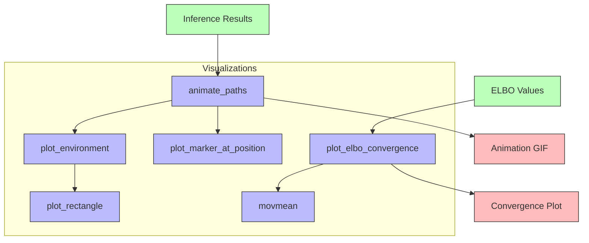

### Animation Process

1. For each time step:
   - Plot the environment with obstacles
   - Plot each agent at its position
   - Draw the path taken so far
   - Optionally show target positions
2. Combine frames into an animated GIF

## Experiment Process

The experiment workflow integrates all components:

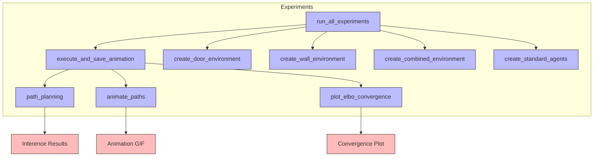

### Full Execution Flow

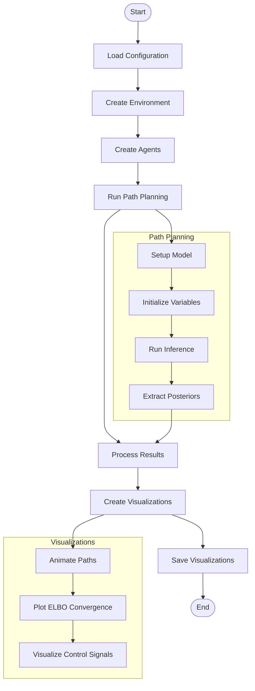

## Detailed System Flow

The following diagram provides a more detailed view of the probabilistic model execution and the connections between key components:

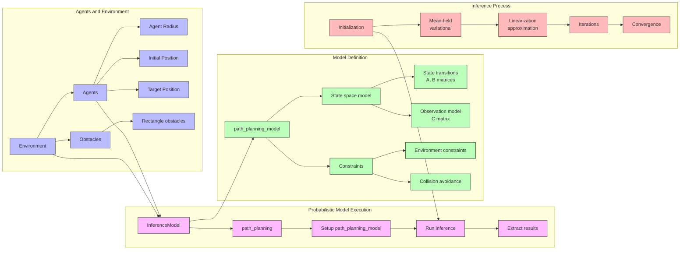

## Step-by-Step Execution Sequence

The complete sequence of operations from configuration to visualization:

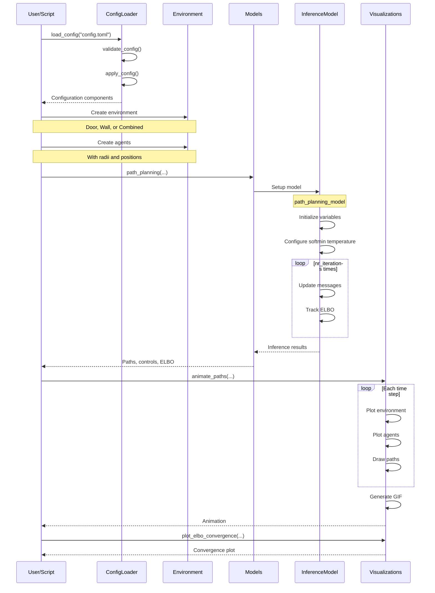

## Mathematical Implementation

### State-Space Representation

The state for each agent is a 4-dimensional vector:
- `[x_position, x_velocity, y_position, y_velocity]`

The system matrices are:
- `A = [1 dt 0 0; 0 1 0 0; 0 0 1 dt; 0 0 0 1]` (state transition)
- `B = [0 0; dt 0; 0 0; 0 dt]` (control input)
- `C = [1 0 0 0; 0 0 1 0]` (observation)

### Variational Inference

The inference uses mean-field variational approximation with the following constraints:
```julia
@constraints function path_planning_constraints()
    q(d, dσ2) = q(d)q(dσ2)
    q(z, zσ2) = q(z)q(zσ2)
end
```

### Prior Distributions

- Initial state: `MvNormal(mean = zeros(4), covariance = initial_state_variance * I)`
- Control inputs: `MvNormal(mean = zeros(2), covariance = control_variance * I)`
- Constraint parameters: `GammaShapeRate(gamma_shape, gamma_scale)`

## Configuration File Structure

The configuration file is structured in TOML format with the following hierarchy:

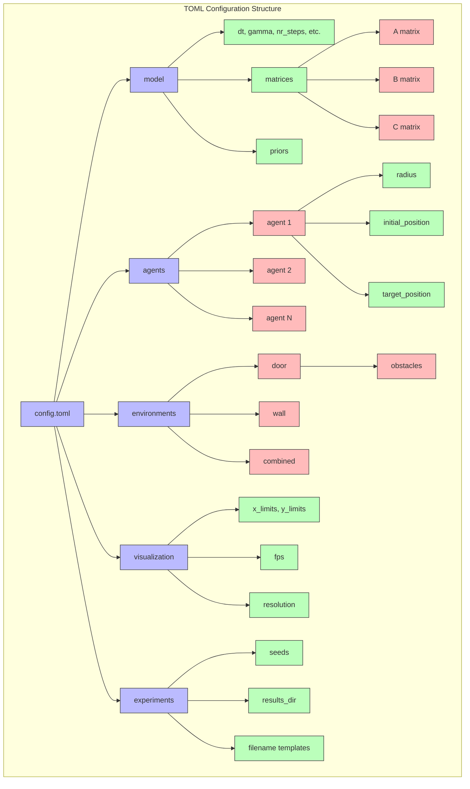

The TOML configuration allows for flexible customization of all aspects of the simulation without modifying the core code. Example entries from the configuration file:

```toml
# Model parameters
[model]
dt = 1.0
gamma = 1.0
nr_steps = 40
nr_iterations = 350

# Agent configuration
[[agents]]
radius = 2.5
initial_position = [-4.0, 10.0]
target_position = [-10.0, -10.0]

# Environment definition
[environments.door]
description = "Two parallel walls with a gap between them"

[[environments.door.obstacles]]
center = [-40.0, 0.0]
size = [70.0, 5.0]
```

## Conclusion

The Multi-agent Trajectory Planning system uses probabilistic inference to generate collision-free trajectories for multiple agents. The modular architecture allows for easy configuration and extension, while the visualizations provide insights into the planning process.

For implementation details, refer to the source code and comments in each module. 