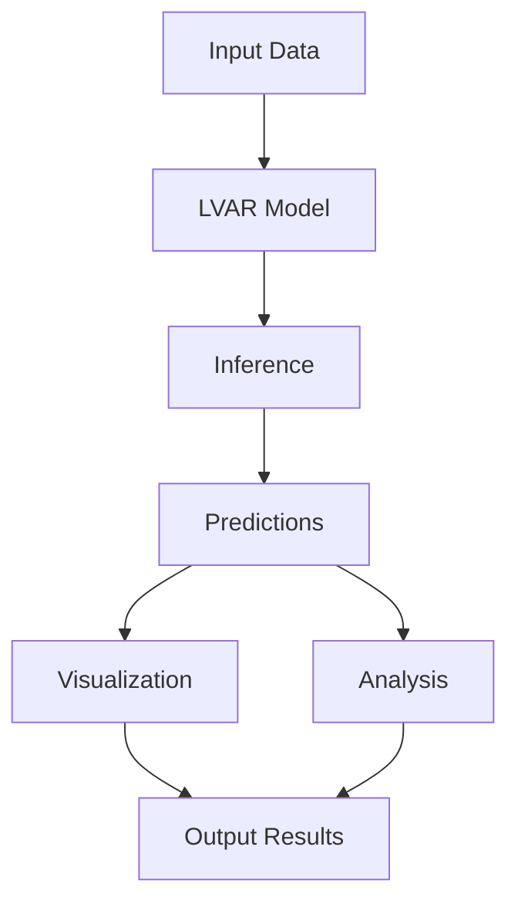
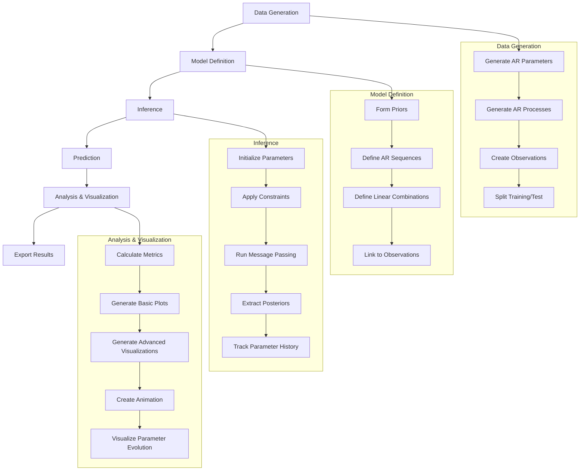
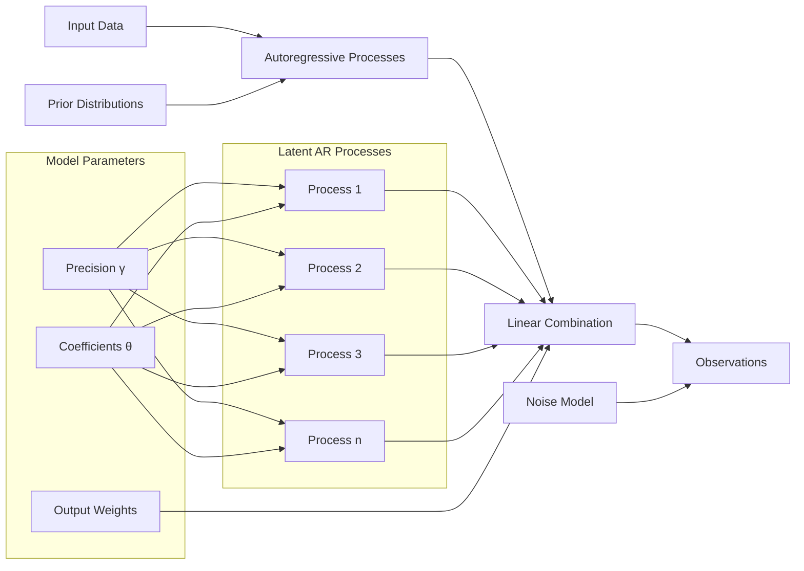
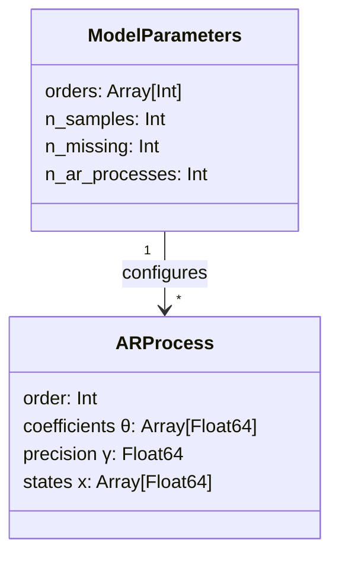
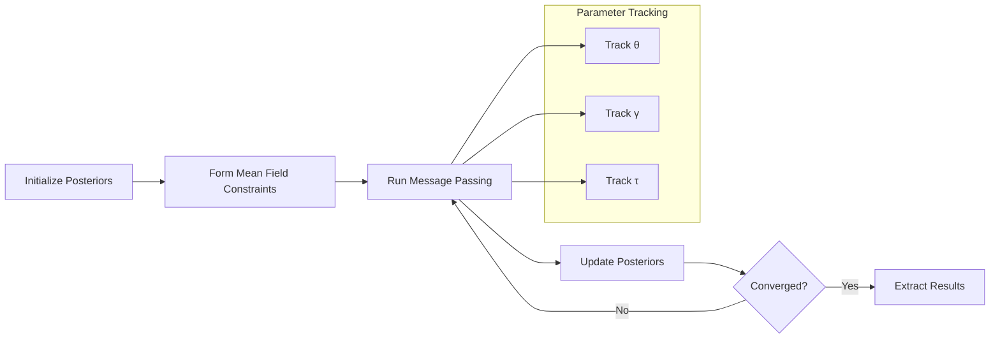
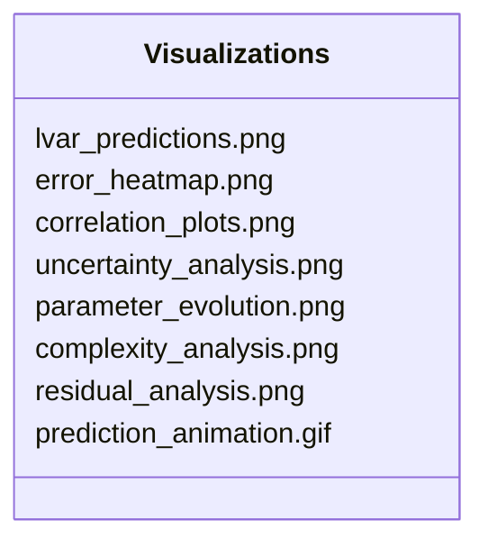
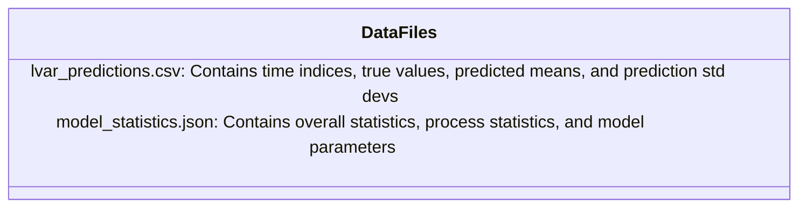
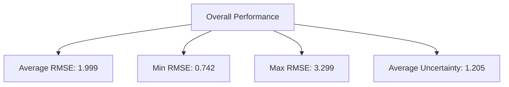
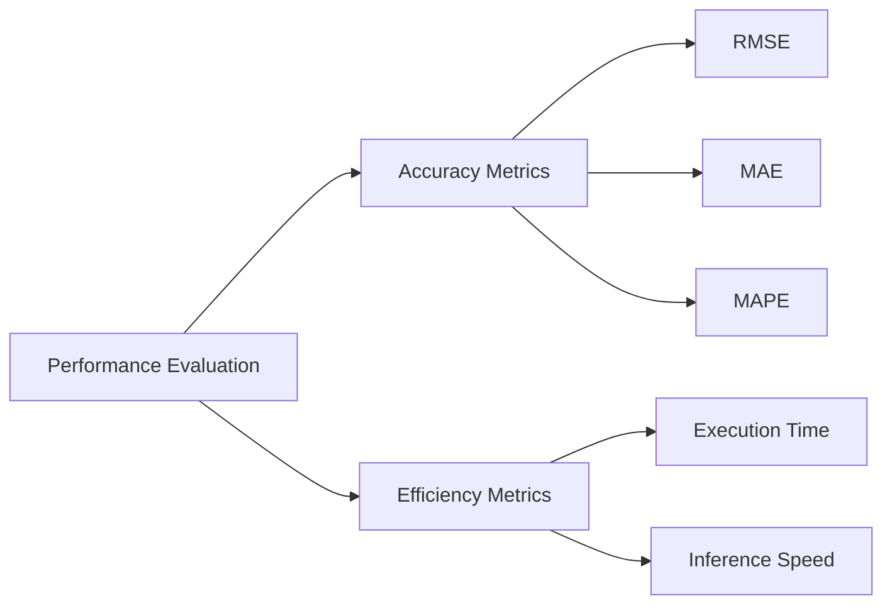
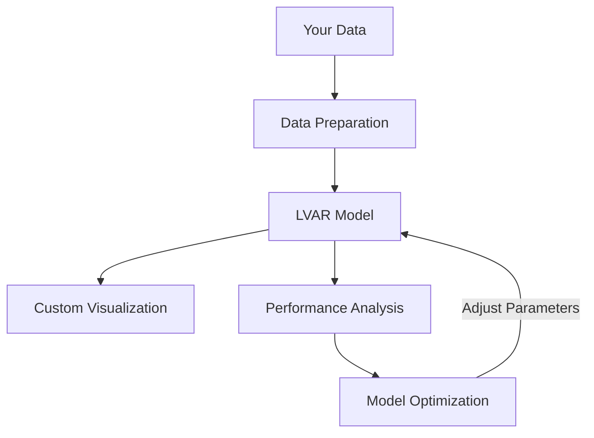

# Latent Vector Autoregressive Model (LVAR)

This directory contains an implementation of a Latent Vector Autoregressive Model using RxInfer.jl. The model is designed to learn from and predict multivariate time series data with underlying autoregressive processes.

## Overview

The Latent Vector Autoregressive Model combines multiple autoregressive (AR) processes into a single unified model. It can be used for:

- Multivariate time series forecasting
- Learning relationships between multiple observed signals
- Capturing the latent structure of complex dynamical systems



## Files

- `LVAR_Refactored.jl` - Main implementation with modular design
- `lva_visualization.jl` - Module for visualizations and data export
- `TECHNICAL_README.md` - Formal model description, derivations, and theory
- `results/` - Directory containing output results (created during execution)

## Complete Workflow



## Model Architecture

The LVAR model consists of:

1. **Multiple AR processes**: Each with its own order and parameters
2. **Latent space representation**: Connecting the AR processes to observations
3. **Variational inference**: For learning parameters and making predictions



## How to Run

Simply execute the main script:

```bash
julia LVAR_Refactored.jl
```

## Model Parameters

The default configuration uses:
- 20 AR processes, each with order 5
- 120 time steps of data (100 for training, 20 for testing)

You can adjust these parameters in the `main()` function.



## Inference Process

The model uses variational message passing through RxInfer.jl to perform Bayesian inference on the model parameters and latent states.



The implementation now tracks the evolution of key model parameters (θ, γ, τ) across iterations, allowing for convergence analysis and better understanding of the inference process.

## Outputs

The script generates various outputs in a timestamped directory under `results/`:

### Visualizations



- **Basic predictions**: Time series plots showing true values, observations, and predictions
- **Error heatmap**: Visualization of prediction errors across processes and time
- **Correlation plots**: Analysis of correlations between processes
- **Uncertainty visualization**: Analysis of prediction uncertainties
- **Parameter evolution**: Plot showing convergence of AR coefficients (θ), process precisions (γ), and observation precision (τ) during inference
- **Model complexity analysis**: SVD-based analysis of the latent structure
- **Residual analysis**: Statistical analysis of prediction residuals
- **Prediction animation**: GIF animation showing predictions evolving over time

### Data Files



The model_statistics.json contains:
- **overall_statistics**: avg_rmse, median_rmse, min_rmse, max_rmse, rmse_std, avg_uncertainty
- **process_statistics**: rmse_by_process (RMSE for each individual process)
- **model_parameters**: n_processes, n_samples, test_samples, training_samples

## Analysis Example

From a sample output in the `results/2025-04-29_082115` directory:



Model configuration for this example:
- 20 AR processes of order 5
- 120 samples (100 for training, 20 for testing)
- Process-specific RMSE varies from 0.742 to 3.299

## Performance Metrics

The script reports various metrics including:
- RMSE (Root Mean Square Error)
- MAE (Mean Absolute Error)
- MAPE (Mean Absolute Percentage Error)
- Execution time and inference speed



## Dependencies

Required Julia packages:
- RxInfer
- Random, LinearAlgebra, Dates, Printf, Statistics
- Plots, DelimitedFiles, StatsBase, JSON
- Distributions, SpecialFunctions

## Extending the Model

To adapt the model for your own data:
1. Modify the `generate_data()` function to load your data instead of synthetic data
2. Adjust the model parameters (orders, number of processes) to match your problem
3. Customize the visualizations as needed



## Contributing

Feel free to improve the implementation or add new features. When making changes, please:
1. Add appropriate error handling
2. Include informative logging
3. Update visualizations as needed
4. Document any new functionality 