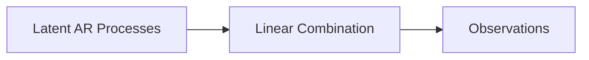
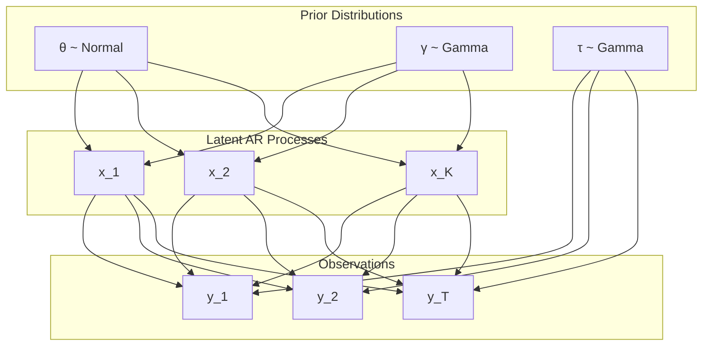

# Latent Vector Autoregressive Model (LVAR): Technical Documentation

This document provides a detailed technical description of the Latent Vector Autoregressive Model (LVAR), including its mathematical formulation, inference methodology, and theoretical foundations.

## Mathematical Formulation

### 1. Autoregressive (AR) Processes

An autoregressive process of order p, denoted as AR(p), models a time series where the output variable depends linearly on its own previous values. For a univariate AR(p) process, the mathematical formulation is:

$$x_t = \sum_{i=1}^{p} \theta_i x_{t-i} + \varepsilon_t, \quad \varepsilon_t \sim \mathcal{N}(0, \gamma^{-1})$$

where:
- $x_t$ is the value of the time series at time $t$
- $\theta_i$ are the AR coefficients
- $p$ is the order of the AR process
- $\varepsilon_t$ is Gaussian noise with precision $\gamma$ (inverse of variance)

### 2. Latent Vector Autoregressive Model

The LVAR model extends this concept by considering multiple AR processes that jointly influence observed multivariate time series through a linear combination. The model structure is as follows:



#### 2.1 Latent AR Processes

For $K$ independent AR processes, each with potentially different orders $p_k$, we have:

$$x_{k,t} = \sum_{i=1}^{p_k} \theta_{k,i} x_{k,t-i} + \varepsilon_{k,t}, \quad \varepsilon_{k,t} \sim \mathcal{N}(0, \gamma_k^{-1})$$

for $k = 1,2,...,K$ and $t = p_k+1,...,T$.

#### 2.2 Linear Combination

The observed multivariate time series $y_t$ is modeled as a linear combination of the latent AR processes:

$$y_t = \sum_{k=1}^{K} b_k \cdot c_k^T x_{k,t} + \eta_t, \quad \eta_t \sim \mathcal{N}(0, \tau^{-1}I)$$

where:
- $y_t$ is the observed $D$-dimensional vector at time $t$
- $b_k$ is a $D$-dimensional output weight vector for the $k$-th AR process
- $c_k$ is a coefficient vector that extracts the current state from the AR process history
- $\tau$ is the precision of the observation noise

## Probabilistic Graphical Model

The complete probabilistic graphical model can be represented as:



## Bayesian Inference

### 1. Prior Distributions

We specify the following prior distributions for the model parameters:

$$\theta_k \sim \mathcal{N}(0, I)$$
$$\gamma_k \sim \text{Gamma}(1, 1)$$
$$\tau \sim \text{Gamma}(1, 1)$$

### 2. Variational Inference

The goal of inference is to compute the posterior distribution over all latent variables and parameters given the observed data:

$$p(\{x_{k,t}\}, \{\theta_k\}, \{\gamma_k\}, \tau | \{y_t\})$$

Since this posterior is intractable, we use variational inference to approximate it. Specifically, we use the mean-field approximation:

$$q(\{x_{k,t}\}, \{\theta_k\}, \{\gamma_k\}, \tau) = \prod_k q(\theta_k) q(\gamma_k) \prod_t q(x_{k,t}, x_{k,t-1}) \cdot q(\tau)$$

### 3. Message Passing

The implementation uses variational message passing (VMP) through the RxInfer.jl framework. This involves iteratively updating the approximate posterior distributions for each variable by passing messages between nodes in the factor graph.

For each latent AR process, the messages are computed as:

$$m_{x_{k,t} \to \theta_k} \propto \exp(\mathbb{E}_{q(x_{k,t-1:t-p_k}), q(\gamma_k)}[\log p(x_{k,t} | x_{k,t-1:t-p_k}, \theta_k, \gamma_k)])$$
$$m_{\theta_k \to x_{k,t}} \propto \exp(\mathbb{E}_{q(\theta_k), q(\gamma_k)}[\log p(x_{k,t} | x_{k,t-1:t-p_k}, \theta_k, \gamma_k)])$$

Similar messages are computed for all variables in the model, and the approximate posteriors are updated accordingly.

## Implementation Details

### 1. Model Definition

In the code, the LVAR model is defined using RxInfer.jl's model specification language:

```julia
@model function LVAR(y, orders)
    priors   = form_priors(orders)
    c, b     = form_c_b(y, orders)
    y_length = length(y)
    
    local x # `x` is being initialized in the loop within submodels
    for k in 1:length(orders)
        x ~ AR_sequence(index = k, length = y_length, priors = priors, order = orders[k])
    end

    τ ~ GammaShapeRate(1.0, 1.0)
    for i in 1:y_length
        μ[i] ~ dot_sequence(k = 1, i = i, orders = orders, x = x, c = c, b = b)
        y[i] ~ MvNormalMeanScalePrecision(μ[i], τ)
    end
end
```

### 2. AR Sequence Submodel

Each AR process is modeled by a separate submodel:

```julia
@model function AR_sequence(x, index, length, priors, order)
    γ ~ priors[:γ][index]
    θ ~ priors[:θ][index]
    x_prev ~ priors[:x][index]
    for i in 1:length
        x[index, i] ~ AR(x_prev, θ, γ) where {
            meta = ARMeta(Multivariate, order, ARsafe())
        }
        x_prev = x[index, i]
    end
end
```

### 3. Linear Combination Submodel

The linear combination of AR processes is defined recursively:

```julia
@model function dot_sequence(out, k, i, orders, x, c, b)
    if k === length(orders)
        out ~ b[k] * dot(c[k], x[k, i])
    else 
        next ~ dot_sequence(k = k + 1, i = i, orders = orders, x = x, c = c, b = b)
        out  ~ b[k] * dot(c[k], x[k, i]) + next
    end
end
```

## Inference Constraints

To make inference tractable, we impose the following factorization constraints:

```julia
@constraints function lvar_constraints()
    for q in AR_sequence
        q(x, x_prev, γ, θ) = q(x, x_prev)q(γ)q(θ)
    end
    q(μ, τ) = q(μ)q(τ)
end
```

This means that:
1. Within each AR sequence, the posterior over parameters (γ, θ) is factorized from the posterior over states (x, x_prev)
2. For the observations, the posterior over the precision τ is factorized from the posterior over the means μ

## Prediction and Forecasting

Once inference is complete, we can use the learned model to make predictions. For in-sample prediction, we use the posterior means of all variables:

$$\hat{y}_t = \sum_{k=1}^{K} b_k \cdot c_k^T \mathbb{E}[x_{k,t}]$$

For out-of-sample forecasting (future time points), we iteratively generate samples from each AR process using the inferred parameters:

$$\hat{x}_{k,t} = \sum_{i=1}^{p_k} \mathbb{E}[\theta_{k,i}] \hat{x}_{k,t-i}$$

Then we combine these forecasts to obtain predictions for the observed variables:

$$\hat{y}_t = \sum_{k=1}^{K} b_k \cdot c_k^T \hat{x}_{k,t}$$

## Uncertainty Quantification

One of the key advantages of the Bayesian approach is uncertainty quantification. The model provides full posterior distributions over all predictions, allowing us to compute:

1. **Prediction means**: The expected value of $y_t$ given the model
2. **Prediction variances**: The uncertainty in the predictions
3. **Credible intervals**: Probability intervals quantifying the range of plausible values

The prediction variance accounts for both aleatoric uncertainty (inherent noise in the data) and epistemic uncertainty (uncertainty in the model parameters).

## Limitations and Extensions

### Current Limitations

1. **Parameter Sharing**: The current implementation does not support parameter sharing across AR processes
2. **Process Orders**: All AR processes must have the same order in the current implementation
3. **Non-stationarity**: The model assumes stationarity in the underlying AR processes

### Possible Extensions

1. **Hierarchical Priors**: Introducing hierarchical priors to allow information sharing across AR processes
2. **Time-varying Parameters**: Extending to time-varying AR parameters for non-stationary data
3. **Structured Sparsity**: Adding sparsity constraints on the output weights to identify the most relevant processes
4. **Non-linear Relationships**: Extending the linear combination to non-linear mappings using neural networks

## References

1. Bishop, C. M. (2006). Pattern Recognition and Machine Learning. Springer.
2. Dauwels, J. (2007). On Variational Message Passing on Factor Graphs. IEEE International Symposium on Information Theory.
3. Winn, J., & Bishop, C. M. (2005). Variational Message Passing. Journal of Machine Learning Research, 6, 661-694.
4. Särkkä, S. (2013). Bayesian Filtering and Smoothing. Cambridge University Press.
5. RxInfer.jl Documentation: [https://reactivebayes.github.io/RxInfer.jl/stable/](https://reactivebayes.github.io/RxInfer.jl/stable/) 