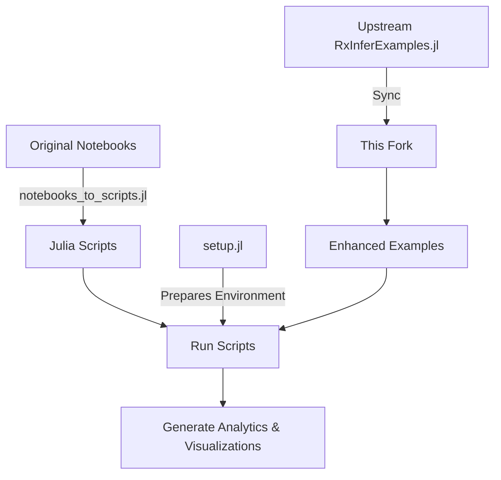
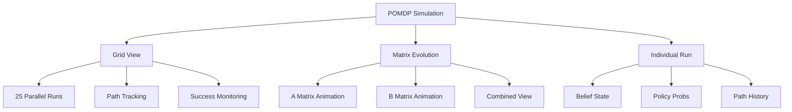

 🚀 RxInferExamples.jl - Enhanced Repository 

## 📋 Overview

This repository is an enhanced fork of the original RxInferExamples.jl that adds several improvements while maintaining compatibility with the upstream repository. It includes automated setup tools, notebook-to-script conversion, and enhanced examples with detailed analytics and visualizations.

## ✨ Key Features

- **Upstream Compatibility** - Can be synced with the original RxInferExamples.jl repository
- **Automated Setup** - Includes `setup.jl` to update Julia and prepare all examples
- **Script Conversion** - Features `notebooks_to_scripts.jl` to convert Jupyter notebooks to executable Julia scripts
- **Enhanced Examples** - Scripts that can serve as starting points for new examples and features
- **Detailed Analytics** - For example, the POMDP Control example includes comprehensive visualizations and analytics

## 🔄 Workflow



## 🛠️ Installation

1. Clone this repository:
   ```bash
   git clone https://github.com/your-username/RxInferExamples.jl.git
   cd RxInferExamples.jl
   ```

2. Run the setup script to initialize the environment:
   ```bash
   julia setup.jl
   ```

## 📊 Enhanced Examples

### POMDP Control with Advanced Analytics

The `run_with_animation.jl` script in the POMDP Control example has been significantly enhanced with:

- **Multi-View Simulations**: 5x5 grid showing 25 simultaneous agent runs
- **Extended Time Horizon**: Support for longer simulations (up to 30 timesteps)
- **Matrix Evolution Visualization**: Animated views of both A (observation) and B (transition) matrices
- **Belief State Tracking**: Heatmap visualizations of agent's belief state evolution
- **Policy Analysis**: Action probability distributions over time
- **Path Analysis**: Tracking and visualization of successful vs unsuccessful paths

#### Visualization Components



#### Output Structure

```
outputs/
├── animations/
│   ├── environment_evolution.gif
│   ├── belief_state_evolution.gif
│   ├── policy_evolution.gif
│   ├── grid_simulation.gif
│   ├── observation_matrix_evolution.gif
│   ├── transition_matrix_evolution.gif
│   └── matrix_evolution_combined.gif
├── matrices/
│   ├── A_matrix_step_*.png
│   └── B_matrices_step_*.png
├── plots/
│   ├── env_state_step_*.png
│   ├── policy_step_*.png
│   ├── belief_state_step_*.png
│   ├── success_rate_by_steps.png
│   └── step_distribution.png
├── analytics/
│   └── experiment_results.txt
├── initial_environment.png
└── final_environment.png
```

### Key Features of Enhanced POMDP Control

1. **Grid Simulation View**
   - 5x5 grid showing 25 parallel simulations
   - Color-coded paths and current positions
   - Step-by-step evolution visualization

2. **Matrix Evolution Analysis**
   - Observation matrix (A) evolution tracking
   - Transition matrix (B) evolution for all actions
   - Combined view showing both matrices simultaneously

3. **Belief State Visualization**
   - Heatmap representation of belief states
   - Step-by-step belief updates
   - Uncertainty visualization

4. **Policy Analysis**
   - Action probability distributions
   - Policy evolution over time
   - Decision-making visualization

5. **Performance Analytics**
   - Success rate tracking
   - Path length distribution
   - Convergence analysis

## 🔍 Usage

To run the enhanced POMDP Control example:

```bash
cd scripts/Basic\ Examples/POMDP\ Control/
julia run_with_animation.jl
```

## 📈 Analytics Output

The script generates comprehensive analytics including:
- Success rates and statistics
- Path length distributions
- Step-by-step visualizations
- Matrix evolution animations
- Grid simulation animations

## 🔄 Syncing with Upstream

This fork maintains compatibility with the original repository. To sync with upstream:

```bash
git remote add upstream https://github.com/original-owner/RxInferExamples.jl.git
git fetch upstream
git merge upstream/main
```

## 📈 Future Improvements

- Interactive visualization controls
- Real-time analytics dashboard
- Additional POMDP environments
- Extended analysis tools
- Performance optimizations

## 👥 Contributing

Contributions are welcome! Please feel free to submit a Pull Request.

## 📄 License

This project is licensed under the same license as the original RxInferExamples.jl repository.
