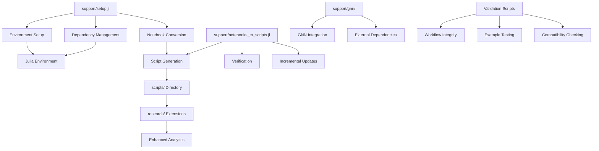
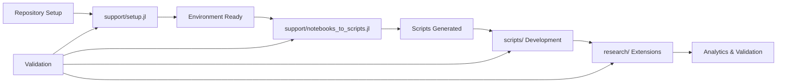
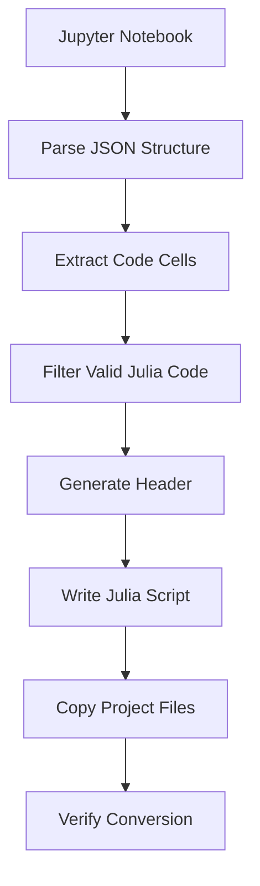
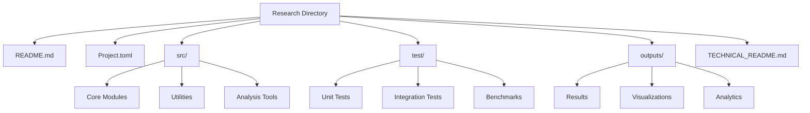
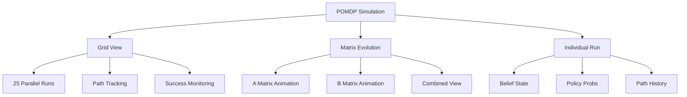

# RxInferExamples.jl Support Utilities

## 📋 Overview

This enhanced fork of RxInferExamples.jl provides comprehensive support utilities for environment management, workflow automation, and research development. The `support/` directory contains essential tools that enable the symbiotic relationship between upstream compatibility and advanced research capabilities.

## ✨ Core Support Features

- **🔧 Automated Setup & Validation**: Comprehensive environment initialization and integrity checking
- **📝 Notebook-to-Script Conversion**: Automated conversion with verification and incremental updates
- **🔍 Environment Management**: Julia version management, dependency resolution, and validation
- **🧪 Testing & Validation**: Automated verification of workflow integrity and example functionality
- **📊 Analytics Integration**: Support for enhanced visualizations and performance analysis
- **🔄 Upstream Synchronization**: Tools to maintain compatibility with the original repository

### Architecture



## 🛠️ Support Tools

### Primary Utilities

#### `setup.jl` - Environment Setup and Validation

Comprehensive setup script that handles:
- Julia environment updates and dependency management
- Project environment initialization and package resolution
- Notebook-to-script conversion integration
- Build system validation and testing

**Usage**:
```bash
julia support/setup.jl [options]
```

**Key Options**:
- `--convert`: Run notebook-to-script conversion
- `--convert-all`: Force conversion of all notebooks (no incremental)
- `--verify`: Verify conversion integrity
- `--clean`: Clean build cache before setup
- `--no-examples`: Skip building examples
- `--no-docs`: Skip building documentation
- `--force`: Continue on non-critical errors
- `--quiet`: Reduce output verbosity

**Example**:
```bash
julia support/setup.jl --convert --verify --clean
```

#### `notebooks_to_scripts.jl` - Conversion Engine

Converts Jupyter notebooks to executable Julia scripts with:
- Recursive directory traversal
- Incremental conversion (skip up-to-date files)
- Project file copying (`Project.toml`, `meta.jl`)
- Code extraction from notebook cells
- Conversion verification and validation

**Usage**:
```bash
julia support/notebooks_to_scripts.jl [options]
```

**Key Options**:
- `--dry-run`: Show planned conversions without executing
- `--skip-existing`: Skip files newer than source notebooks
- `--force`: Reconvert all targeted notebooks
- `--filter SUBSTR`: Convert only notebooks containing SUBSTR
- `--verify`: Verify 1:1 mapping after conversion
- `--quiet`: Reduce output verbosity
- `--list`: List notebooks that would be processed

**Example**:
```bash
julia support/notebooks_to_scripts.jl --skip-existing --verify --quiet
```

### Secondary Utilities

#### `gnn/` - External Integration Support

Contains utilities for integrating with external systems:
- GNN (Generalized Neural Network) integration scripts
- Clone and setup automation for external repositories
- Dependency management for specialized tools

#### `server/` - Python Integration

Python client for RxInfer server integration:
- RxInferClient.py for remote model execution
- Server connection and API management
- Authentication and result processing

### Workflow Integration

The support utilities are designed to work seamlessly with the overall repository workflow:



#### Automated Pipeline

The support tools enable automated workflow execution:

1. **Environment Preparation**: `setup.jl` ensures all dependencies are met
2. **Content Conversion**: `notebooks_to_scripts.jl` creates executable baselines
3. **Development Ready**: Scripts in `scripts/` are ready for modification
4. **Research Extension**: Enhanced implementations move to `research/`
5. **Validation Loop**: Continuous verification maintains integrity

#### Error Handling and Recovery

- **Graceful Degradation**: Scripts handle errors and provide meaningful feedback
- **Incremental Processing**: Failed conversions don't stop the overall process
- **Recovery Mechanisms**: Built-in retry and recovery options
- **Validation Feedback**: Clear reporting of success/failure states

## 📋 Detailed Usage Guide

### Initial Setup

1. **Clone Repository**:
   ```bash
   git clone https://github.com/your-username/RxInferExamples.jl.git
   cd RxInferExamples.jl
   ```

2. **Comprehensive Setup** (Recommended):
   ```bash
   julia support/setup.jl --convert --verify --clean
   ```

   This performs:
   - Environment cleanup and preparation
   - Julia and package updates
   - Notebook-to-script conversion with verification
   - Example building and testing
   - Documentation generation

### Development Workflow

1. **Daily Development**:
   ```bash
   # Quick validation and conversion
   julia support/setup.jl --convert --verify

   # Work with converted scripts in scripts/
   cd scripts/Basic\ Examples/Coin\ Toss\ Model/
   julia coin_toss_model.jl
   ```

2. **Research Development**:
   ```bash
   # Convert notebooks if needed
   julia support/notebooks_to_scripts.jl --skip-existing

   # Develop extensions in research/
   cd research/generalized_coordinates/
   julia run_gc_suite.jl
   ```

3. **Testing and Validation**:
   ```bash
   # Run full validation
   julia support/setup.jl --convert --verify --force

   # Test specific components
   julia --project=research/generalized_coordinates test/runtests.jl
   ```

## 🔄 Notebook-to-Script Conversion System

### Overview

The `notebooks_to_scripts.jl` utility provides automated conversion of Jupyter notebooks to executable Julia scripts while maintaining:

- **Incremental Processing**: Only converts changed notebooks
- **Project Structure Preservation**: Copies `Project.toml` and `meta.jl` files
- **Code Quality**: Extracts and cleans Julia code from notebook cells
- **Verification**: Validates conversion integrity and 1:1 mapping
- **Error Recovery**: Handles conversion failures gracefully

### Conversion Process



#### Code Extraction

The conversion engine:
1. Parses notebook JSON structure
2. Identifies code cells (`"cell_type": "code"`)
3. Extracts source code from cell `"source"` arrays
4. Filters out cells with only comments or empty code
5. Concatenates code blocks with double newlines

#### Project File Handling

For each notebook directory containing project files:
- Copies `Project.toml` to maintain dependencies
- Copies `meta.jl` to preserve metadata
- Creates mirrored directory structure in `scripts/`

### Advanced Usage Patterns

#### Incremental Development

```bash
# Convert only changed notebooks
julia support/notebooks_to_scripts.jl --skip-existing

# Force reconversion of all notebooks
julia support/notebooks_to_scripts.jl --force

# Convert specific examples only
julia support/notebooks_to_scripts.jl --filter "Kalman" --force
```

#### Validation and Quality Assurance

```bash
# Verify conversion integrity
julia support/notebooks_to_scripts.jl --verify

# List notebooks that would be processed
julia support/notebooks_to_scripts.jl --list --filter "Basic"

# Dry run to preview changes
julia support/notebooks_to_scripts.jl --dry-run --force
```

#### Integration with Development Workflow

```bash
# Part of daily development routine
julia support/notebooks_to_scripts.jl --skip-existing --quiet

# Before committing changes
julia support/notebooks_to_scripts.jl --verify --force

# After pulling upstream changes
julia support/notebooks_to_scripts.jl --force --verify
```

### Best Practices

#### Development Workflow

1. **Start with Conversion**: Always run conversion before modifying scripts
2. **Use Incremental Mode**: Leverage `--skip-existing` for faster iteration
3. **Verify Integrity**: Use `--verify` before committing changes
4. **Handle Dependencies**: Ensure `Project.toml` files are properly copied
5. **Test Scripts**: Run converted scripts to validate functionality

#### Code Quality

- **Clean Extraction**: The converter removes notebook artifacts and formatting
- **Preserve Structure**: Maintains code organization and comments
- **Error Handling**: Gracefully handles malformed notebooks
- **Metadata Preservation**: Keeps important metadata in generated scripts

#### Performance Optimization

- **Incremental Processing**: Only processes changed files by default
- **Parallel Ready**: Designed to handle multiple conversions efficiently
- **Memory Efficient**: Streams processing to minimize memory usage
- **Fast Validation**: Quick verification of conversion integrity

### Troubleshooting

#### Common Issues

1. **Missing Dependencies**:
   ```bash
   # Ensure project environments are set up
   julia --project=examples -e 'using Pkg; Pkg.instantiate()'
   ```

2. **Conversion Errors**:
   ```bash
   # Run with verbose output
   julia support/notebooks_to_scripts.jl --force

   # Check specific notebook
   julia support/notebooks_to_scripts.jl --filter "problem_notebook" --force
   ```

3. **Verification Failures**:
   ```bash
   # Verify and fix mapping issues
   julia support/notebooks_to_scripts.jl --verify --force

   # Check for missing scripts
   find scripts/ -name "*.jl" | wc -l
   find examples/ -name "*.ipynb" | wc -l
   ```

#### Recovery Procedures

1. **Reset Conversion State**:
   ```bash
   # Force reconvert everything
   julia support/notebooks_to_scripts.jl --force

   # Clean and rebuild
   julia support/setup.jl --clean --convert-all --verify
   ```

2. **Handle Corrupted Notebooks**:
   ```bash
   # Skip problematic notebooks
   julia support/notebooks_to_scripts.jl --filter "working_example" --force

   # Manual conversion for specific files
   julia -e 'include("support/notebooks_to_scripts.jl")' -- --force
   ```

### Integration with Research Workflow

The conversion system enables seamless transition from notebooks to research:

1. **Baseline Creation**: Converts notebooks to establish starting points
2. **Script Enhancement**: Scripts in `scripts/` serve as development baselines
3. **Research Extension**: Enhanced scripts move to `research/` for advanced work
4. **Validation Loop**: Continuous conversion verification ensures consistency

## 🔬 Research Development Workflow

### Overview

The `research/` directory contains extended implementations and advanced research explorations that build upon the converted scripts from `scripts/`. This creates a symbiotic relationship where:

- **Baseline Scripts** (`scripts/`): Stable, converted versions of upstream examples
- **Research Extensions** (`research/`): Advanced implementations with analytics and enhancements
- **Mutual Benefits**: Research improvements can inform script enhancements, while scripts provide stable baselines

### Research Directory Structure

Each research subdirectory follows a consistent, modular structure:



### Standard Research Structure

#### Essential Files

1. **`README.md`**: Research-specific documentation and usage guide
2. **`Project.toml`**: Isolated environment with research-specific dependencies
3. **`TECHNICAL_README.md`**: Detailed technical documentation and methodology

#### Source Organization (`src/`)

```julia
src/
├── ResearchModule.jl          # Main module definition
├── CoreImplementation.jl      # Primary research implementation
├── AnalysisTools.jl          # Analytics and visualization utilities
├── Benchmarking.jl           # Performance evaluation tools
└── Utilities.jl              # Helper functions and utilities
```

#### Testing Structure (`test/`)

```julia
test/
├── runtests.jl              # Main test runner
├── test_core.jl             # Core functionality tests
├── test_analysis.jl         # Analytics and visualization tests
├── test_benchmarks.jl       # Performance benchmark tests
└── test_integration.jl      # Integration tests with scripts/
```

#### Output Organization (`outputs/`)

```text
outputs/
├── results/                 # Primary research results
│   ├── data/               # Raw data files
│   ├── processed/          # Processed results
│   └── analysis/           # Analysis outputs
├── visualizations/         # Generated plots and animations
│   ├── static/            # Static visualizations
│   ├── animations/        # Animated visualizations
│   └── interactive/       # Interactive visualizations
├── logs/                  # Execution logs and debugging info
└── reports/               # Generated reports and summaries
```

### Key Research Areas

#### Generalized Coordinates Research

**Location**: `research/generalized_coordinates/`

Advanced implementation of generalized coordinates with:
- Comprehensive free energy analysis
- Multi-dimensional state estimation
- Performance benchmarking across scenarios
- Automated report generation

#### Higher-Order Generalized Coordinates

**Location**: `research/generalized_coordinates_n_order/`

Extension to higher-order coordinate systems:
- N-order coordinate transformations
- Advanced numerical integration
- Model visualization and analysis

#### Hierarchical Gaussian Filters

**Location**: `research/hgf/`

Implementation of hierarchical filtering with:
- Multi-level state estimation
- Volatility and trend modeling
- Neural network integration

### Development Workflow

#### Phase 1: Baseline Establishment

1. **Convert Notebooks**: Establish baseline scripts
2. **Validate Scripts**: Ensure scripts run correctly

#### Phase 2: Research Development

1. **Create Research Structure**:
   ```bash
   mkdir -p research/my_research/src research/my_research/test research/my_research/outputs
   ```

2. **Initialize Environment**:
   ```bash
   cd research/my_research
   julia --project=. -e 'using Pkg; Pkg.instantiate()'
   ```

3. **Develop Extensions**: Build upon baseline scripts with enhancements

#### Phase 3: Integration and Validation

1. **Cross-Validation**: Ensure compatibility between scripts and research
2. **Performance Testing**: Benchmark enhancements against baselines
3. **Documentation**: Update documentation to reflect research findings

## 📊 Enhanced Examples

### POMDP Control with Advanced Analytics

The `run_with_animation.jl` script in the POMDP Control example has been significantly enhanced with:

- **Multi-View Simulations**: 5x5 grid showing 25 simultaneous agent runs
- **Extended Time Horizon**: Support for longer simulations (up to 30 timesteps)
- **Matrix Evolution Visualization**: Animated views of both A (observation) and B (transition) matrices
- **Belief State Tracking**: Heatmap visualizations of agent's belief state evolution
- **Policy Analysis**: Action probability distributions over time
- **Path Analysis**: Tracking and visualization of successful vs unsuccessful paths

#### Visualization Components



#### Output Structure

```text
outputs/
├── animations/
│   ├── environment_evolution.gif
│   ├── belief_state_evolution.gif
│   ├── policy_evolution.gif
│   ├── grid_simulation.gif
│   ├── observation_matrix_evolution.gif
│   ├── transition_matrix_evolution.gif
│   └── matrix_evolution_combined.gif
├── matrices/
│   ├── A_matrix_step_*.png
│   └── B_matrices_step_*.png
├── plots/
│   ├── env_state_step_*.png
│   ├── policy_step_*.png
│   ├── belief_state_step_*.png
│   ├── success_rate_by_steps.png
│   └── step_distribution.png
├── analytics/
│   └── experiment_results.txt
├── initial_environment.png
└── final_environment.png
```

### Key Features of Enhanced POMDP Control

1. **Grid Simulation View**
   - 5x5 grid showing 25 parallel simulations
   - Color-coded paths and current positions
   - Step-by-step evolution visualization

2. **Matrix Evolution Analysis**
   - Observation matrix (A) evolution tracking
   - Transition matrix (B) evolution for all actions
   - Combined view showing both matrices simultaneously

3. **Belief State Visualization**
   - Heatmap representation of belief states
   - Step-by-step belief updates
   - Uncertainty visualization

4. **Policy Analysis**
   - Action probability distributions
   - Policy evolution over time
   - Decision-making visualization

5. **Performance Analytics**
   - Success rate tracking
   - Path length distribution
   - Convergence analysis

## 🔍 Usage

To run the enhanced POMDP Control example:

```bash
cd scripts/Basic\ Examples/POMDP\ Control/
julia run_with_animation.jl
```

## 🔁 Notebook to Script Conversion

Convert notebooks in `examples/` into mirrored `.jl` files under `scripts/`:

```bash
julia support/notebooks_to_scripts.jl --skip-existing --verify
```

Useful flags:

- `--dry-run`: show planned conversions only
- `--filter SUBSTR`: process only notebooks whose path contains `SUBSTR`
- `--list`: list targeted notebooks
- `--force`: regenerate all targeted scripts
- `--quiet`: reduce output verbosity

## 📈 Analytics Output

The script generates comprehensive analytics including:

- Success rates and statistics
- Path length distributions
- Step-by-step visualizations
- Matrix evolution animations
- Grid simulation animations

## 🔄 Syncing with Upstream

This fork maintains compatibility with the original repository. To sync with upstream:

```bash
git remote add upstream https://github.com/original-owner/RxInferExamples.jl.git
git fetch upstream
git merge upstream/main
```

## 📚 Learn More About RxInfer

For background on RxInfer and its ecosystem:

- JOSS paper: [RxInfer: A Julia package for reactive real-time Bayesian inference](https://doi.org/10.21105/joss.05161)
- RxInfer.jl repository and roadmap: [ReactiveBayes/RxInfer.jl on GitHub](https://github.com/ReactiveBayes/RxInfer.jl)
- BIASlab RxInfer landing: [rxinfer-website](https://biaslab.github.io/rxinfer-website/)

## 📈 Future Improvements

- Interactive visualization controls
- Real-time analytics dashboard
- Additional POMDP environments
- Extended analysis tools
- Performance optimizations

## 👥 Contributing

Contributions are welcome! Please feel free to submit a Pull Request.

## 📄 License

This project is licensed under the same license as the original RxInferExamples.jl repository.
